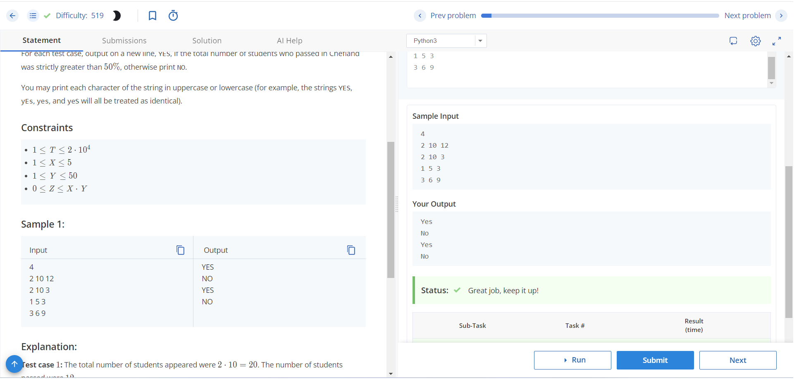
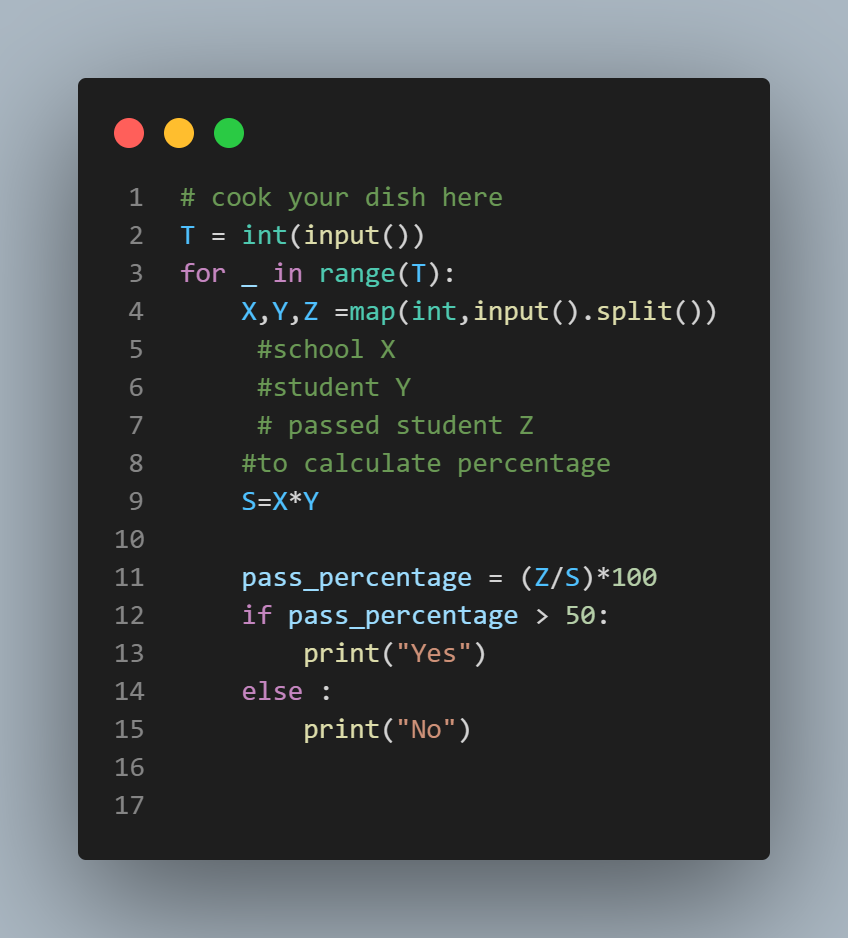

# Chefland Exams

In Chefland, there are X schools, and each school has Y students. The year-end results are in, and a total of Z students passed the exams.

Assuming that all students appeared for the exams, find whether the number of students who passed in Chefland was strictly greater than 50%.

### Input Format

The first line of input will contain a single integer T, denoting the number of test cases.
Each test case consists of three space-separated integers X, Y, and Z, as mentioned in the statement.

### Output Format

For each test case, output on a new line, "YES", if the total number of students who passed in Chefland was strictly greater than 50%, otherwise print "NO".

You may print each character of the string in uppercase or lowercase (for example, the strings YES, yEs, yes, and yeS will all be treated as identical).

### Constraints

- 1 ≤ T ≤ 2 * 10^4
- 1 ≤ X ≤ 5
- 1 ≤ Y ≤ 50
- 0 ≤ Z ≤ X * Y

### Sample Input

```
4
2 10 12
2 10 3
1 5 3
3 6 9

```
### Sample output
```
YES
NO
YES
NO
```


## Explanation

- Test case 1: The total number of students appeared were 20. The number of students passed were 12. Thus, the number of students who passed is 60%, which is strictly greater than 50%.
- Test case 2: The total number of students appeared were 20. The number of students passed were 3. Thus, the number of students who passed is 15%, which is less than 50%.
- Test case 3: The total number of students appeared were 5. The number of students passed were 3. Thus, the number of students who passed is 60%, which is strictly greater than 50%.
- Test case 4: The total number of students appeared were 18. The number of students passed were 9. Thus, the number of students who passed is 50%, which is equal to 50%.


