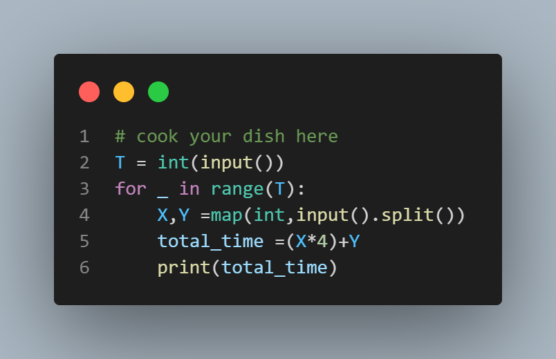
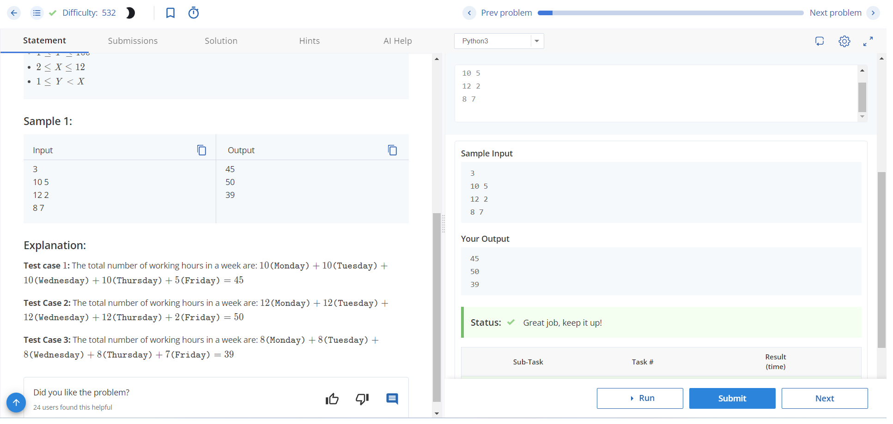

# Chef in his Office

Recently Chef joined a new company. In this company, the employees have to work for X hours each day from Monday to Thursday. Also, in this company, Friday is called Chill Day — employees only have to work for Y hours (Y < X) on Friday. Saturdays and Sundays are holidays.

Determine the total number of working hours in one week.

### Input Format

The first line contains a single integer T — the number of test cases. Then the test cases follow.
The first and only line of each test case contains two space-separated integers X and Y — the number of working hours on each day from Monday to Thursday and the number of working hours on Friday respectively.

### Output Format

For each test case, output the total number of working hours in one week.

### Constraints

- 1 ≤ T ≤ 100
- 2 ≤ X ≤ 12
- 1 ≤ Y < X

### Sample Input
```
3
10 5
12 2
8 7
```

### Sample output
```
45
50
39
```

## Explanation

- Test case 1: The total number of working hours in a week are: 10 (Monday) + 10 (Tuesday) + 10 (Wednesday) + 10 (Thursday) + 5 (Friday) = 45
- Test case 2: The total number of working hours in a week are: 12 (Monday) + 12 (Tuesday) + 12 (Wednesday) + 12 (Thursday) + 2 (Friday) = 50
- Test case 3: The total number of working hours in a week are: 8 (Monday) + 8 (Tuesday) + 8 (Wednesday) + 8 (Thursday) + 7 (Friday) = 39



