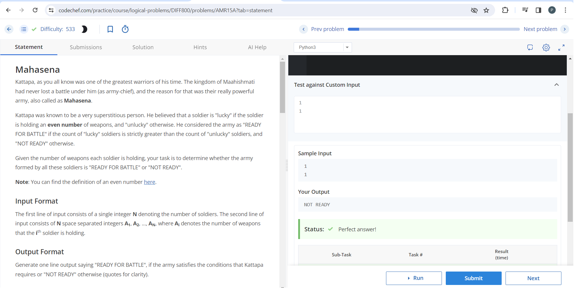

# Mahasena

Kattapa, as you all know, was one of the greatest warriors of his time. The kingdom of Maahishmati had never lost a battle under him (as army-chief), and the reason for that was their really powerful army, also called Mahasena.

Kattapa was known to be a very superstitious person. He believed that a soldier is "lucky" if the soldier is holding an even number of weapons, and "unlucky" otherwise. He considered the army as "READY FOR BATTLE" if the count of "lucky" soldiers is strictly greater than the count of "unlucky" soldiers, and "NOT READY" otherwise.

Given the number of weapons each soldier is holding, your task is to determine whether the army formed by all these soldiers is "READY FOR BATTLE" or "NOT READY".

### Input Format

The first line of input consists of a single integer N denoting the number of soldiers. The second line of input consists of N space-separated integers A1, A2, ..., AN, where Ai denotes the number of weapons that the ith soldier is holding.

### Output Format

Generate one line output saying "READY FOR BATTLE", if the army satisfies the conditions that Kattapa requires or "NOT READY" otherwise (quotes for clarity).

### Constraints

- 1 ≤ N ≤ 100
- 1 ≤ Ai ≤ 100

### Sample Input

```
4
11 12 13 14
```

### sample output 

```
NOT READY
```

### Explanation

For  example, we have N = 4 soldiers with the following number of weapons:

- Soldier 1: 11 weapons (odd)
- Soldier 2: 12 weapons (even)
- Soldier 3: 13 weapons (odd)
- Soldier 4: 14 weapons (even)

To determine if the army is "READY FOR BATTLE", we count the number of soldiers with an even number of weapons and the number of soldiers with an odd number of weapons.

- Number of soldiers with an even number of weapons: 2 (Soldiers 2 and 4)
- Number of soldiers with an odd number of weapons: 2 (Soldiers 1 and 3)

Since the number of soldiers with an even number of weapons is not strictly greater than the number of soldiers with an odd number of weapons (they are equal), the army is "NOT READY" for battle.


