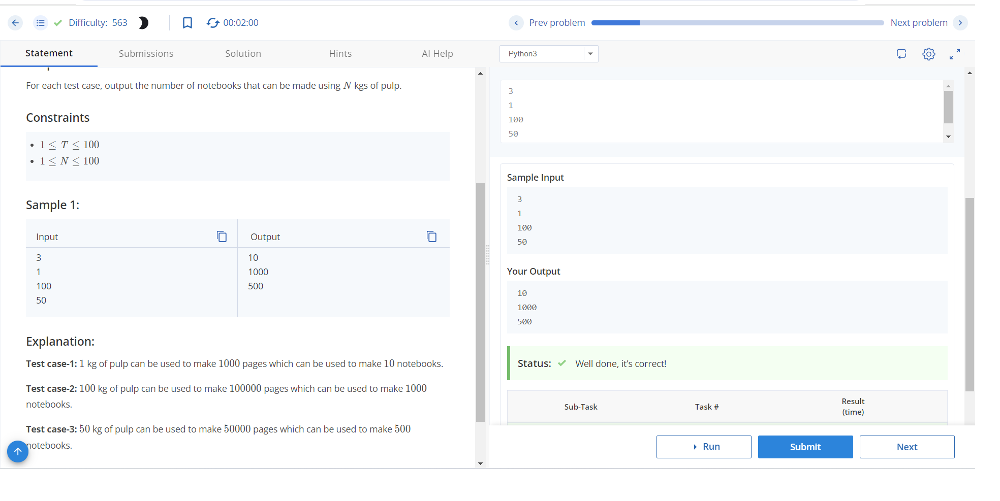
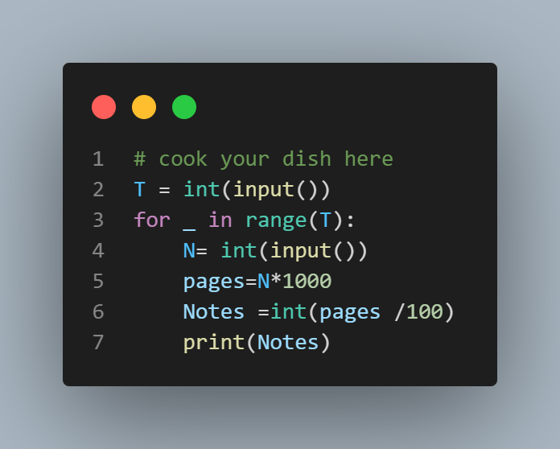

# Count the Notebooks

## Description

In a notebook factory, 1 kg of pulp can be used to make 1000 pages, and 1 notebook consists of 100 pages. Given the weight of pulp the factory has (in kilograms), determine how many notebooks can be made from it.

## Input Format

The input consists of T test cases, where each test case is represented by:
- The first line containing an integer T, the number of test cases.
- Each of the next T lines containing a single integer N, the weight of the pulp the factory has (in kilograms).

## Output Format

For each test case, output the number of notebooks that can be made using N kilograms of pulp on a new line.

## Constraints

- 1 ≤ T ≤ 100 (number of test cases)
- 1 ≤ N ≤ 100 (weight of pulp in kilograms)

## Sample Input
```
3
1
100
50
```

## sample output 
```
10
1000
500
```

## Explanation

- Test case 1: 1 kg of pulp can be used to make 1000 pages, which can be used to make 10 notebooks.
- Test case 2: 100 kg of pulp can be used to make 100000 pages, which can be used to make 1000 notebooks.
- Test case 3: 50 kg of pulp can be used to make 50000 pages, which can be used to make 500 notebooks.


