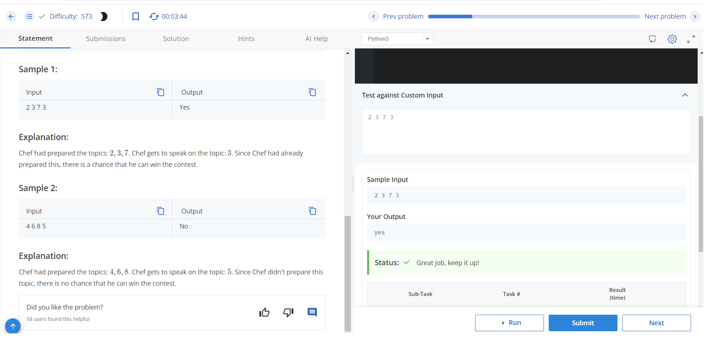
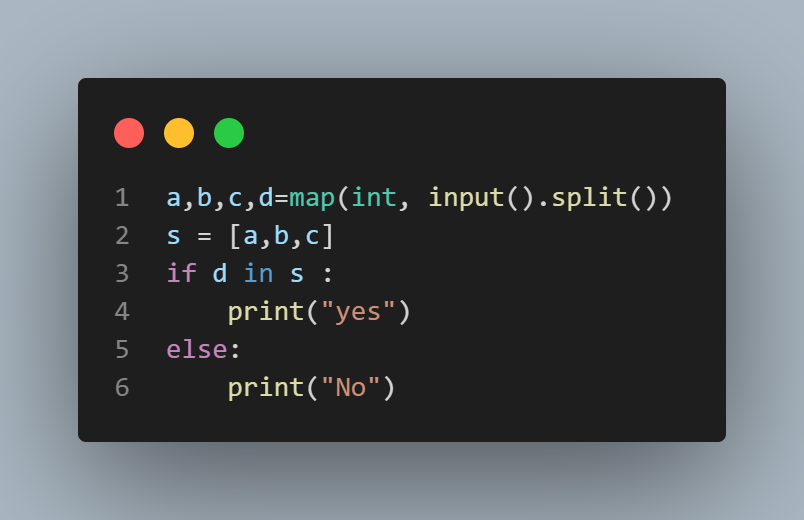

# The Three Topics

The Chef has reached the finals of the Annual Inter-school Declamation contest. For the finals, students were asked to prepare 10 topics. However, Chef was only able to prepare three topics, numbered A, B, and C. This means Chef can only win the contest if he gets the topics A, B, or C to speak about.

On the contest day, Chef gets topic X. This program determines whether Chef has any chances of winning the competition.

## Input Format

The first and only line of input contains four space-separated integers A, B, C, and X, where A, B, C are the three topics Chef has prepared, and X is the topic that was given to him on the contest day.

## Output Format

For each test case, output in a single line "Yes" if it is possible for Chef to win the contest, else print "No".

## Constraints

- 1 ≤ A, B, C, X ≤ 10
- A, B, C are distinct.

## Sample Input

```
2 3 7 3
```

## sample output 
```
yes
no
```


## Explanation

- Chef had prepared the topics: 2, 3, 7. Chef gets to speak on the topic: 3. Since Chef had already prepared this, there is a chance that he can win the contest.
- Chef had prepared the topics: 4, 6, 8. Chef gets to speak on the topic: 5. Since Chef didn't prepare this topic, there is no chance that he can win the contest.


