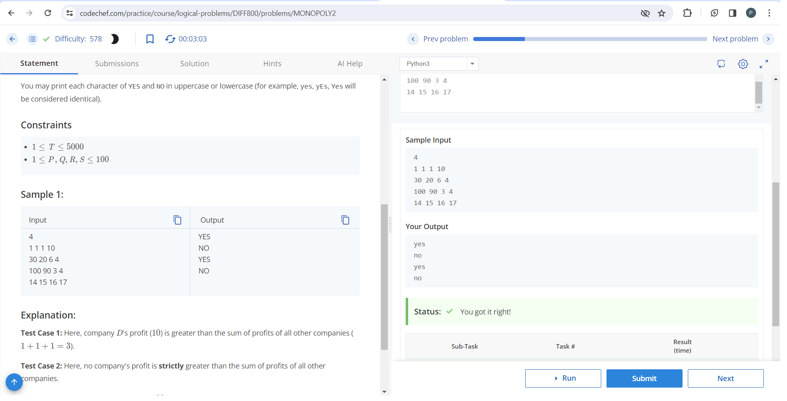
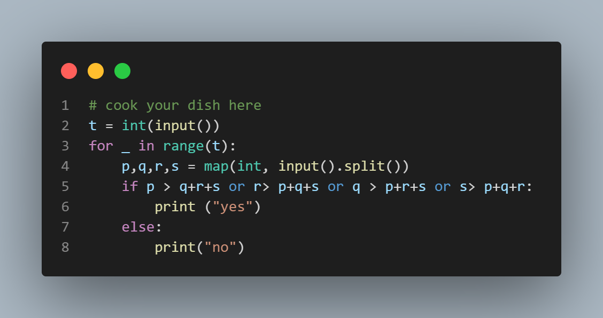

# Monopoly

In the markets of Chefland, there are 4 companies: A, B, C, and D. This program determines if there is a monopoly in the market.

A monopoly exists if the profit made by one company is strictly greater than the sum of profits made by all other companies combined.

## Input Format

The first line of input contains an integer T, the number of test cases.
For each test case:
- The first and only line contains four space-separated integers P, Q, R, and S, representing the profits made by companies A, B, C, and D respectively.

## Output Format

For each test case, output "YES" if there is a monopoly in the market. Otherwise, output "NO".

You may print each character of YES and NO in either uppercase or lowercase.

## Constraints

- 1 ≤ T ≤ 5000
- 1 ≤ P, Q, R, S ≤ 100

## Sample Input

```
4
1 1 1 10
30 20 6 4
100 90 3 4
14 15 16 17

```

## sample output
```
YES
NO
YES
NO
```


## Explanation

- Test Case 1: Company D's profit (10) is greater than the sum of profits of all other companies (1 + 1 + 1 = 3).
- Test Case 2: No company's profit is strictly greater than the sum of profits of all other companies.
- Test Case 3: Company A's profit (100) is greater than the sum of profits of all other companies (90 + 3 + 4 = 97).
- Test Case 4: No company's profit is strictly greater than the sum of profits of all other companies.

