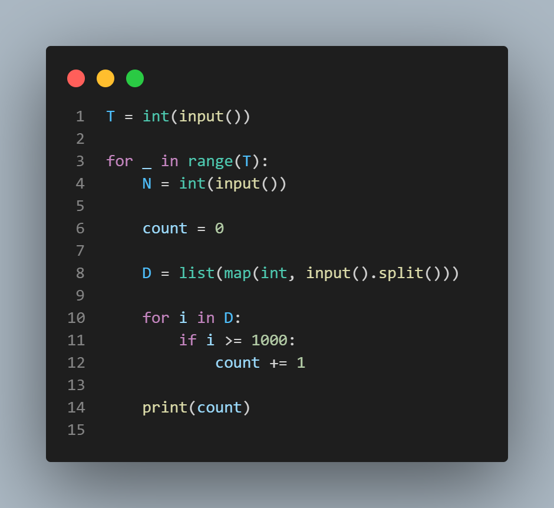

# Problems in Your To-Do List

## Problem Description

Chef recently found out that he can add problems to a personal to-do list. However, he added loads of problems without looking at their difficulty ratings. Given a list of difficulty ratings for problems in Chef’s to-do list, help him identify how many problems he should remove from his to-do list so that he is only left with problems of difficulty rating less than 1000.

## Input Format

The first line of input contains a single integer T, the number of test cases.
Each test case consists of two lines of input:
- The first line contains a single integer N, the total number of problems that Chef has added to his to-do list.
- The second line contains N space-separated integers D1, D2, ..., D_N, the difficulty ratings for each problem in the to-do list.

## Output Format

For each test case, output in a single line the number of problems that Chef will have to remove so that all remaining problems have a difficulty rating strictly less than 1000.

## Constraints
- 1 ≤ T ≤ 1000
- 1 ≤ N ≤ 1000
- 1 ≤ D_i ≤ 5000

## Sample Input
```
5
3
800 1200 900
4 
999 1000 1001 1002
5
1 2 2 2 5000
5
1000 1000 1000 1000 10000
3
900 700 800
```

## Explanation
- Test case 1: Chef needs to remove the problem with difficulty rating 1200, since it is ≥ 1000. So, the answer is 1.
- Test case 2: Chef needs to remove the problems with difficulty ratings of 1000, 1001, and 1002, since they are ≥ 1000. So, the answer is 3.
- Test case 3: Chef needs to remove the problem with a difficulty rating of 5000, since it is ≥ 1000. So, the answer is 1.
- Test case 4: Chef needs to remove all the five problems, since they are all rated ≥ 1000. So, the answer is 5.
- Test case 5: Chef does not need to remove any problem, since they are all rated < 1000. So, the answer is 0.
 
 
