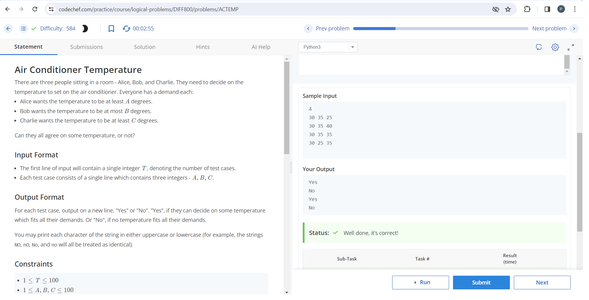

# Air Conditioner Temperature

## Problem Description
There are three people sitting in a room - Alice, Bob, and Charlie. They need to decide on the temperature to set on the air conditioner. Everyone has a demand each:
- Alice wants the temperature to be at least A degrees.
- Bob wants the temperature to be at most B degrees.
- Charlie wants the temperature to be at least C degrees.
Can they all agree on some temperature, or not?

## Input Format
The first line of input will contain a single integer T, denoting the number of test cases.
Each test case consists of a single line which contains three integers A, B, C.

## Output Format
For each test case, output on a new line, "Yes" or "No". "Yes", if they can decide on some temperature which fits all their demands. Or "No", if no temperature fits all their demands.

## Constraints
- 1 ≤ T ≤ 100
- 1 ≤ A, B, C ≤ 100

## Sample Input
```
4
30 35 25
30 35 40 
30 35 35
30 25 35
```

## sample output

```
Yes
No 
Yes
No
```
## Explanation
- Test Case 1: Alice wants the temperature to be at least 30, Bob wants it to be at most 35, and Charlie wants it to be at least 25. The temperatures 30, 31, 32, 33, 34, 35 all satisfy all their demands. So they can choose any of these 6 temperatures, and so the answer is "Yes".
- Test Case 2: Alice wants the temperature to be at least 30, Bob wants it to be at most 35, and Charlie wants it to be at least 40. A number can't be both at least 40 and at most 35. So there is no temperature that satisfies all their demands. So the answer is "No".
- Test Case 3: Alice wants the temperature to be at least 30, Bob wants it to be at most 35, and Charlie wants it to be at least 35. The temperature 35 satisfies all their demands. So the answer is "Yes".
- Test Case 4: Alice wants the temperature to be at least 30, Bob wants it to be at most 25, and Charlie wants it to be at least 35. A number can't be both at least 30 and at most 25. So there is no temperature that satisfies all their demands. So the answer is "No".


