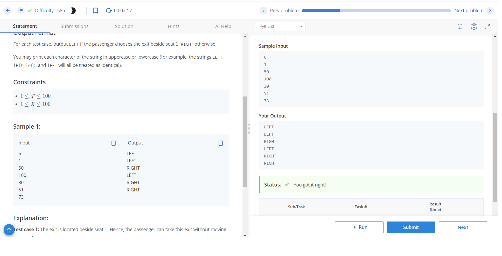
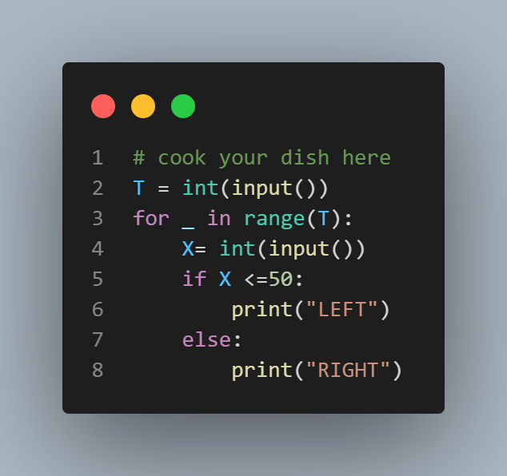

# Nearest Exit

## Problem Description

There are two exits in a bus with 100 seats:
- First exit is located beside seat number 1.
- Second exit is located beside seat number 100.
Seats are arranged in a straight line from 1 to 100 with equal spacing between any two adjacent seats. A passenger prefers to choose the nearest exit while leaving the bus. Determine the exit taken by a passenger sitting on seat X.

## Input Format

The first line of input contains a single integer T, denoting the number of test cases.
Each test case consists of a single integer X, denoting the seat number.

## Output Format

For each test case, output LEFT if the passenger chooses the exit beside seat 1, RIGHT otherwise.

You may print each character of the string in uppercase or lowercase (for example, the strings LEFT, lEft, left, and lEFT will all be treated as identical).

## Constraints

1 ≤ T ≤ 100
1 ≤ X ≤ 100

## Sample Input
```
6
1
50
100
30
51
73
```
## sample output
```
LEFT
LEFT 
RIGHT
LEFT
RIGHT
RIGHT

```

## Explanation

- Test case 1: The exit is located beside seat 1. Hence, the passenger can take this exit without moving to any other seat.
- Test case 2: To take the exit at seat 1, the passenger needs to move 49 seats. However, to take the exit at seat 100, the passenger needs to move 50 seats. Thus, the exit at seat 1 is closer.
- Test case 3: The exit is located beside seat 100. Hence, the passenger can take this exit without moving to any other seat.
- Test case 4: To take the exit at seat 1, the passenger needs to move 29 seats. However, to take the exit at seat 100, the passenger needs to move 70 seats. Thus, the exit at seat 1 is closer.

