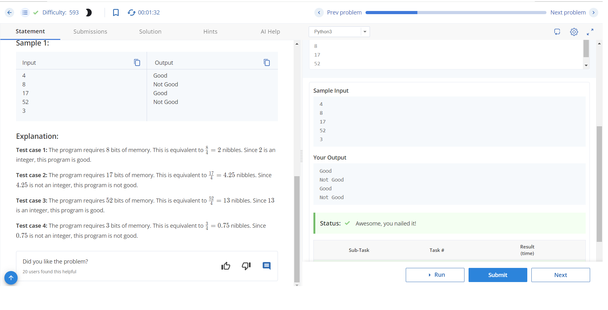

# Good Program

## Problem Description

In computing, the collection of four bits is called a nibble.

Chef defines a program as:

Good, if it takes exactly X nibbles of memory, where X is a positive integer.
Not Good, otherwise.
Given a program which takes N bits of memory, determine whether it is Good or Not Good.

## Input Format

The first line contains T, the number of test cases. Then the test cases follow.
Each test case contains a single integer N, the number of bits taken by the program.

## Output Format

For each test case, output "Good" or "Not Good" in a single line. You may print each character of "Good" or "Not Good" in uppercase or lowercase (for example, "GoOd", "GOOD", "good" will be considered identical).

## Constraints

1 ≤ T ≤ 1000
1 ≤ N ≤ 1000

## Sample Input
```
4
8
17
52
3
```

## sample output 
```
Good
Not Good
Good 
Not Good
```

## Explanation

- Test case 1: The program requires 8 bits of memory. This is equivalent to 8/4 = 2 nibbles. Since 2 is an integer, this program is good.
- Test case 2: The program requires 17 bits of memory. This is equivalent to 17/4 = 4.25 nibbles. Since 4.25 is not an integer, this program is not good.
- Test case 3: The program requires 52 bits of memory. This is equivalent to 52/4 = 13 nibbles. Since 13 is an integer, this program is good.
- Test case 4: The program requires 3 bits of memory. This is equivalent to 3/4 = 0.75 nibbles. Since 0.75 is not an integer, this program is not good.
 
 