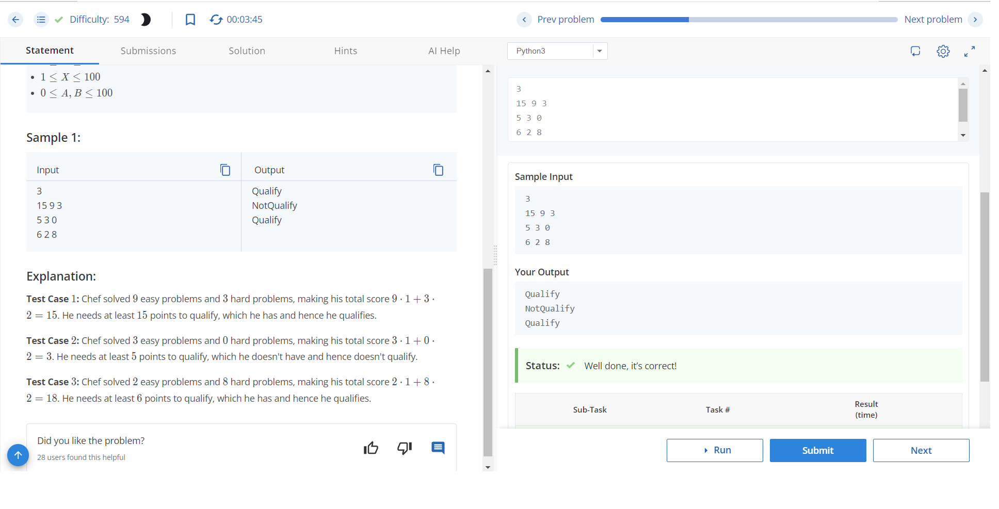
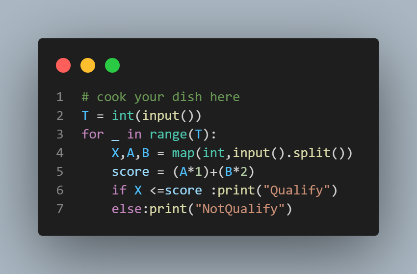

# Qualify the round

## Problem Description

In a coding contest, there are two types of problems:

- Easy problems, which are worth 1 point each
- Hard problems, which are worth 2 points each

To qualify for the next round, a contestant must score at least X points. Chef solved A Easy problems and B Hard problems. Will Chef qualify or not?

## Input Format

The first line of input contains a single integer T, denoting the number of test cases. The description of T test cases follows.
Each test case consists of a single line of input containing three space-separated integers — X, A, and B.

## Output Format

For each test case, output a new line containing the answer — Qualify if Chef qualifies for the next round, and NotQualify otherwise.

Each character of the answer may be printed in either uppercase or lowercase. For example, if the answer is Qualify, outputs such as qualify, quALiFy, QUALIFY and QuAlIfY will also be accepted as correct.

## Constraints

1 ≤ T ≤ 100
1 ≤ X ≤ 100
0 ≤ A, B ≤ 100

## Sample Input/Output
3
15 9 3
5 3 0
6 2 8
## sample output
```Qualify
NotQualify
Qualify
```


## Explanation

- Test Case 1: Chef solved 9 easy problems and 3 hard problems, making his total score 9*1 + 3*2 = 15. He needs at least 15 points to qualify, which he has and hence he qualifies.
- Test Case 2: Chef solved 3 easy problems and 0 hard problems, making his total score 3*1 + 0*2 = 3. He needs at least 5 points to qualify, which he doesn't have and hence doesn't qualify.
- Test Case 3: Chef solved 2 easy problems and 8 hard problems, making his total score 2*1 + 8*2 = 18. He needs at least 6 points to qualify, which he has and hence he qualifies.

