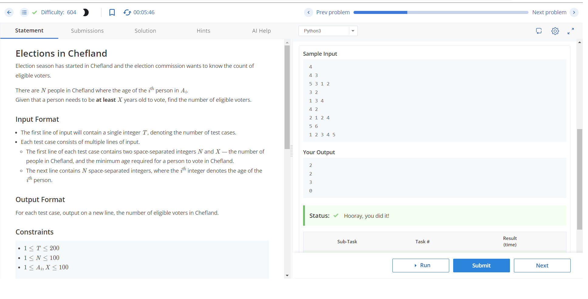
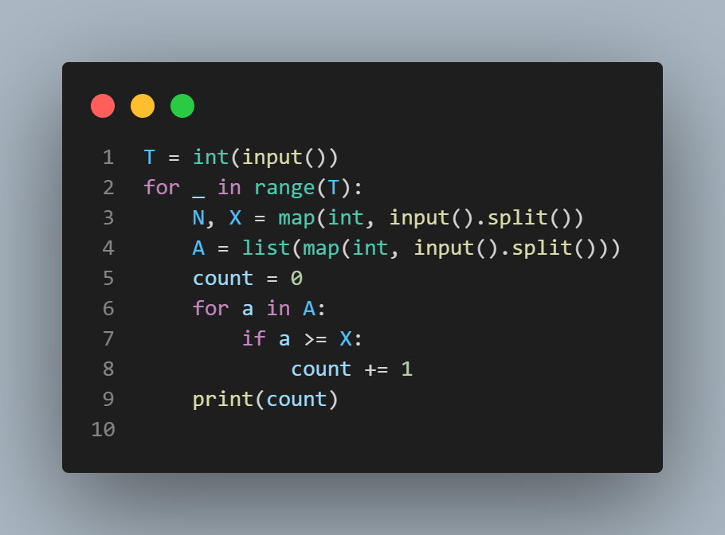

# Elections in Chefland

## Problem Description

Election season has started in Chefland and the election commission wants to know the count of eligible voters.

There are N people in Chefland where the age of the i-th person is Ai. Given that a person needs to be at least X years old to vote, find the number of eligible voters.

## Input Format

The first line of input will contain a single integer T, denoting the number of test cases.
Each test case consists of multiple lines of input.
The first line of each test case contains two space-separated integers N and X — the number of people in Chefland, and the minimum age required for a person to vote in Chefland.
The next line contains N space-separated integers, where the i-th integer denotes the age of the i-th person.

## Output Format

For each test case, output on a new line, the number of eligible voters in Chefland.

## Constraints

1 ≤ T ≤ 200
1 ≤ N ≤ 100
1 ≤ Ai, X ≤ 100

## Sample Input
```
4
4 3 
5 3 1 2
3 2
1 3 4
 4 2 
 2 1 2 4
 5 6 
 1 2 3 4 5```

 
## Explanation

- Test case 1: The minimum age to vote in Chefland is 3 years. There are 2 people with age greater than or equal to 3 and thus, there are 2 eligible voters.
- Test case 2: The minimum age to vote in Chefland is 2 years. There are 2 people with age greater than or equal to 2 and thus, there are 2 eligible voters.
- Test case 3: The minimum age to vote in Chefland is 2 years. There are 3 people with age greater than or equal to 2 and thus, there are 3 eligible voters.
- Test case 4: The minimum age to vote in Chefland is 6 years. There are no people with age greater than or equal to 6 and thus, there are no eligible voters.


