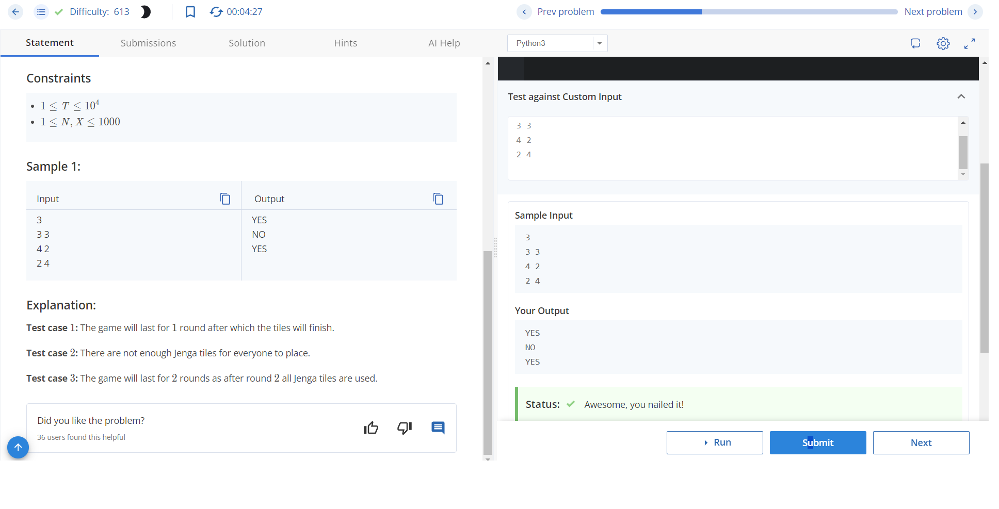
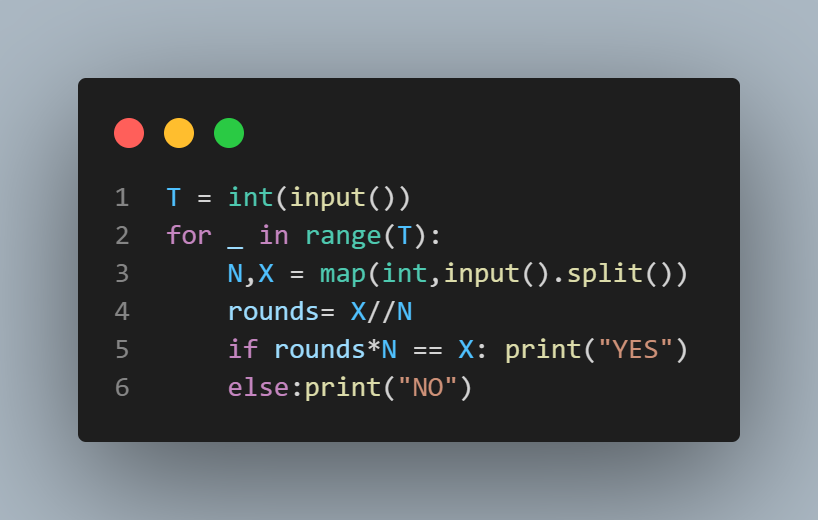

# Jenga Night Problem

## Problem Statement

Chef hosts a party for his birthday. There are N people at the party. All these N people decide to play Jenga.

There are X Jenga tiles available. In one round, all the players pick 1 tile each and place it in the tower.

The game is valid if:
- All the players have a tile in each round.
- All the tiles are used at the end.

Given N and X, find whether the game is valid.

### Input Format

The first line will contain T, the number of test cases. Then the test cases follow.
Each test case contains a single line of input, containing two space-separated integers N and X representing the number of people at the party and the number of available tiles respectively.

### Output Format

For each test case, output in a single line YES if the game is valid, else output NO.

You may print each character of the string in uppercase or lowercase (for example, the strings YeS, yEs, yes and YES will all be treated as identical).

### Constraints

- 1 ≤ T ≤ 10^4
- 1 ≤ N, X ≤ 1000

### Sample Input

    ```3
    3 3 
    4 2 
    2 4
    ```
### sample output
```YES
NO
YES
```

### Explanation

- Test case 1: The game will last for 1 round after which the tiles will finish.
- Test case 2: There are not enough Jenga tiles for everyone to place.
- Test case 3: The game will last for 2 rounds as after round 2 all Jenga tiles are used.


