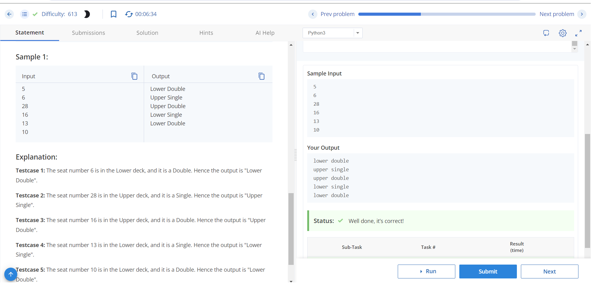
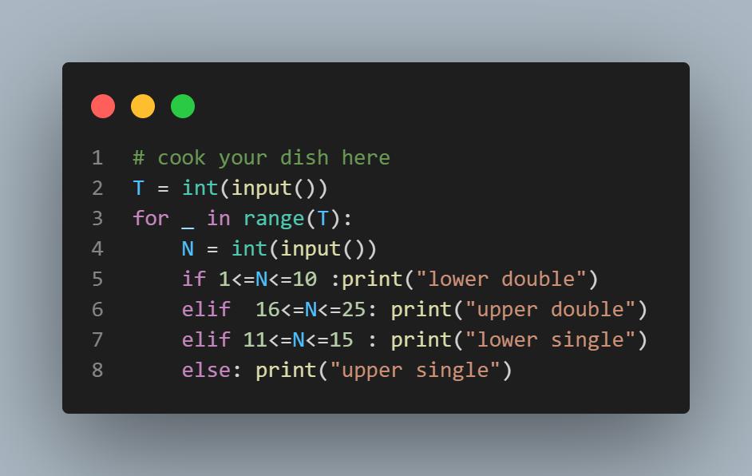

# Bus Seat Numbering Problem

## Problem Statement

There is a bus with 30 seats. The seats are numbered from 1 to 30, and the numbering is as depicted in this image.


As can be seen in the image, the bus is divided into two decks - The Lower deck, and the Upper deck, with 15 seats each. And some of the seats come as Single and some as Double. For example, Seats 1 and 2 are Double, whereas Seat 11 is a Single.

You will be given a Seat number, and your job is to classify it as one of these 4 types:

- Lower Single
- Lower Double
- Upper Single
- Upper Double

### Input Format

The first line of input will contain a single integer T, denoting the number of test cases. Each test case consists of a single line of input which contains a single integer N — the seat number.

### Output Format

For each test case, output on a new line, the type of seat.

### Constraints

- 1 ≤ T ≤ 100
- 1 ≤ N ≤ 30

### Sample Input

```
5
6
28
16
13
10
```
## sample output
```
Lower Double
Upper Single
Upper Double 
Lower single
Lower Double
```

### Explanation

- Test case 1: The seat number 6 is in the Lower deck, and it is a Double. Hence the output is "Lower Double".
- Test case 2: The seat number 28 is in the Upper deck, and it is a Single. Hence the output is "Upper Single".
- Test case 3: The seat number 16 is in the Upper deck, and it is a Double. Hence the output is "Upper Double".
- Test case 4: The seat number 13 is in the Lower deck, and it is a Single. Hence the output is "Lower Single".
- Test case 5: The seat number 10 is in the Lower deck, and it is a Double. Hence the output is "Lower Double".

This README provides a clear explanation of the problem, input/output format, constraints, and a sample input/output with explanations.


