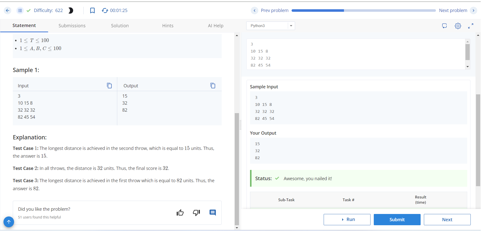
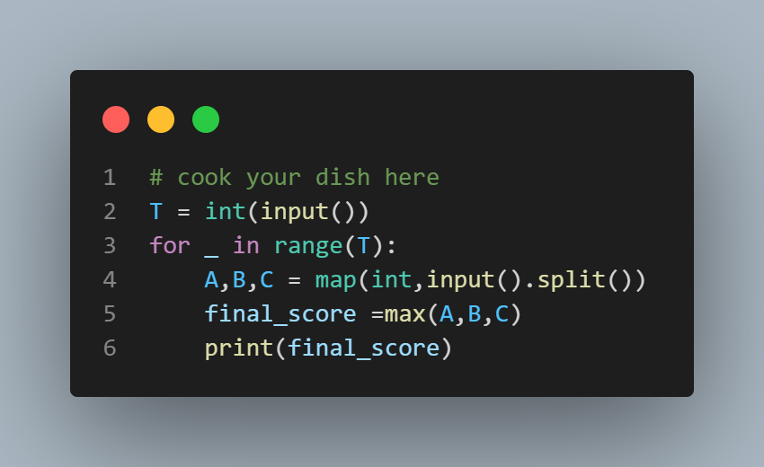

# Discus Throw Problem

## Problem Statement

In discus throw, a player is given 3 throws and the throw with the longest distance is regarded as their final score.

You are given the distances for all 3 throws of a player. Determine the final score of the player.

### Input Format

The first line will contain T, the number of test cases. Then the test cases follow.
Each test case consists of a single line of input containing three integers A, B, and C, denoting the distances in each throw.

### Output Format

For each test case, output the final score of the player.

### Constraints

- 1 ≤ T ≤ 100
- 1 ≤ A, B, C ≤ 100

### Sample Input
```
3
10 15 8
32 32 32 
82 45 54
```

### sample output
```
15
32
82
```

### Explanation

- Test Case 1: The longest distance is achieved in the second throw, which is equal to 15 units. Thus, the answer is 15.
- Test Case 2: In all throws, the distance is 32 units. Thus, the final score is 32.
- Test Case 3: The longest distance is achieved in the first throw, which is equal to 82 units. Thus, the answer is 82.

This README provides a clear explanation of the problem, input/output format, constraints, and a sample input/output with explanations.


