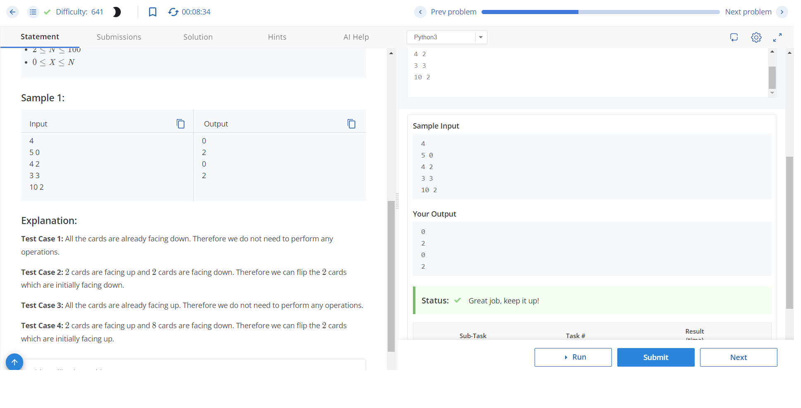
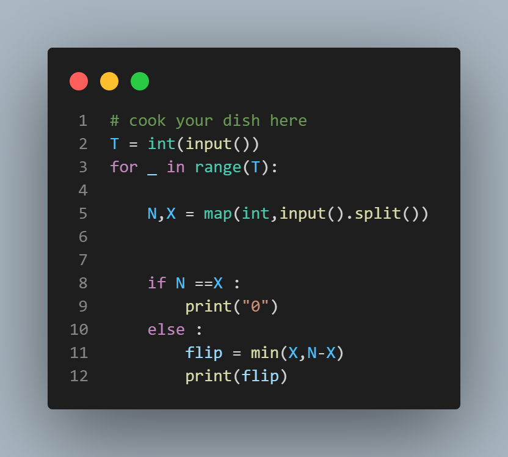

# Flip the Cards Problem

## Problem Statement

There are N cards on a table, out of which X cards are face-up and the remaining are face-down. In one operation, we can select any one card and flip it (i.e. if it was initially face-up, after the operation, it will be face-down and vice versa). What is the minimum number of operations we must perform so that all the cards face in the same direction (i.e. either all are face-up or all are face-down)?

### Input Format

The first line contains a single integer T — the number of test cases. Then the test cases follow. Each test case contains two space-separated integers N and X — the total number of cards and the number of cards which are initially face-up.

### Output Format

For each test case, output the minimum number of cards you must flip so that all the cards face in the same direction.

### Constraints

- 1 ≤ T ≤ 5000
- 2 ≤ N ≤ 100
- 0 ≤ X ≤ N

### Sample Input

```
4
5 0
4 2
3 3
10 2
```

### sample output

```
0
2
0
2
```

### Explanation

- Test Case 1: All the cards are already facing down. Therefore we do not need to perform any operations.
- Test Case 2: 2 cards are facing up and 2 cards are facing down. Therefore we can flip the 2 cards which are initially facing down.
- Test Case 3: All the cards are already facing up. Therefore we do not need to perform any operations.
- Test Case 4: 2 cards are facing up and 8 cards are facing down. Therefore we can flip the 2 cards which are initially facing up.

This README provides a clear explanation of the problem, input/output format, constraints, and a sample input/output with explanations.

