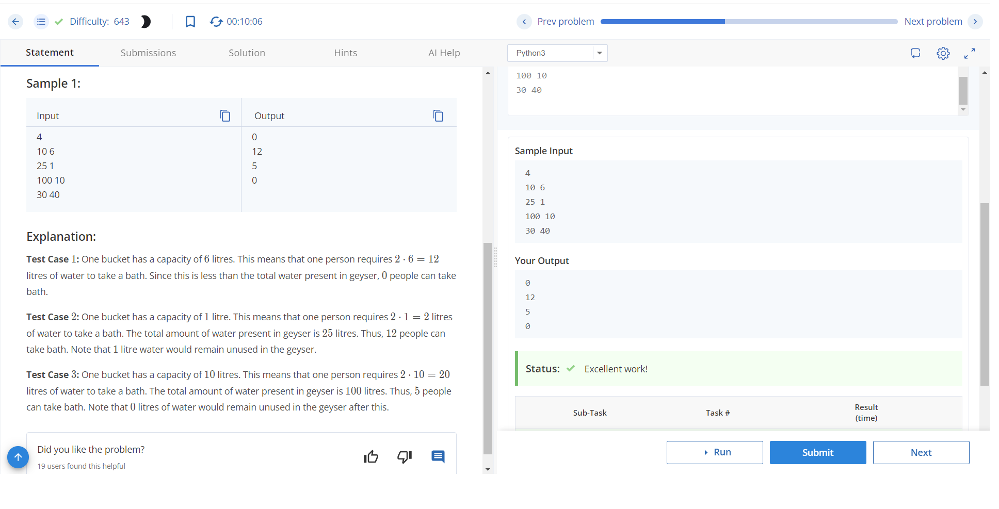
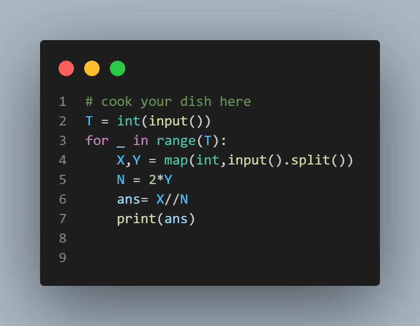

# Bath in Winters Problem

## Problem Statement

A geyser has a capacity of X litres of water and a bucket has a capacity of Y litres of water. One person requires exactly 2 buckets of water to take a bath. Find the maximum number of people that can take a bath using water from one completely filled geyser.

### Input Format

The first line contains T, the number of test cases. Then the test cases follow. Each test case contains a single line of input, two integers X, Y.

### Output Format

For each test case, output the maximum number of people that can take a bath.

### Constraints

- 1 ≤ T ≤ 1000
- 1 ≤ X, Y ≤ 100

### Sample Input

```
4
10 6 
25 1
100 10
30 40
```
### sample output
```
0
12
5
0

```


### Explanation

- Test Case 1: One bucket has a capacity of 6 litres. This means that one person requires 2 * 6 = 12 litres of water to take a bath. Since this is less than the total water present in the geyser, 0 people can take a bath.
- Test Case 2: One bucket has a capacity of 1 litre. This means that one person requires 2 * 1 = 2 litres of water to take a bath. The total amount of water present in the geyser is 25 litres. Thus, 12 people can take a bath. Note that 1 litre water would remain unused in the geyser.
- Test Case 3: One bucket has a capacity of 10 litres. This means that one person requires 2 * 10 = 20 litres of water to take a bath. The total amount of water present in the geyser is 100 litres. Thus, 5 people can take a bath. Note that 0 litres of water would remain unused in the geyser after this.

This README provides a clear explanation of the problem, input/output format, constraints, and a sample input/output with explanations.

