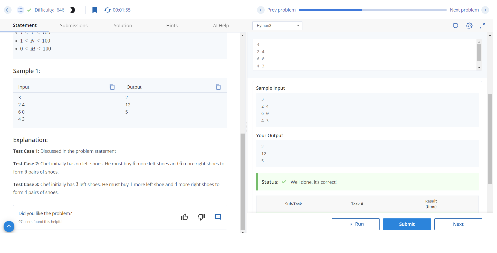

# Chef's Shoe Dilemma

## Problem Description
Chef has N friends. He promised that he would gift a pair of shoes (consisting of one left shoe and one right shoe) to each of his N friends. However, Chef realizes he already has M left shoes. The task is to find the minimum number of extra shoes Chef will have to buy to ensure that he can gift a pair of shoes to each of his N friends.

## Input Format
The input consists of T test cases. The first line contains a single integer T - the number of test cases. Each test case follows:
- The first line of each test case contains two integers N and M - the number of Chef's friends and the number of left shoes Chef has.

## Output Format
For each test case, output the minimum number of extra shoes that Chef will have to buy to ensure that he is able to get N pairs of shoes.

## Constraints
- 1 ≤ T ≤ 100
- 1 ≤ N ≤ 100
- 0 ≤ M ≤ 100

## sample input 
```
3
2 4
6 0 
4 3
```
## Sample output
```
3
2 4
6 0
4 3
```

## Explanation
- In the first test case, Chef already has 4 left shoes and needs to buy 2 extra right shoes to form 2 pairs of shoes.
- In the second test case, Chef initially has no left shoes. He must buy 6 more left shoes and 6 more right shoes to form 6 pairs of shoes.
- In the third test case, Chef initially has 3 left shoes. He must buy 1 more left shoe and 4 more right shoes to form 4 pairs of shoes.

