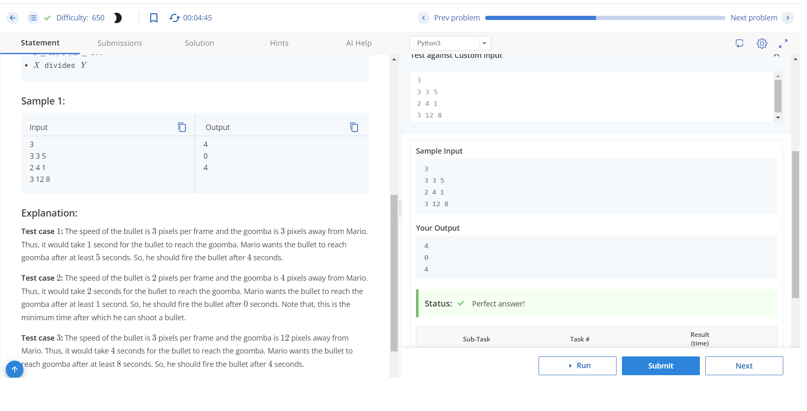
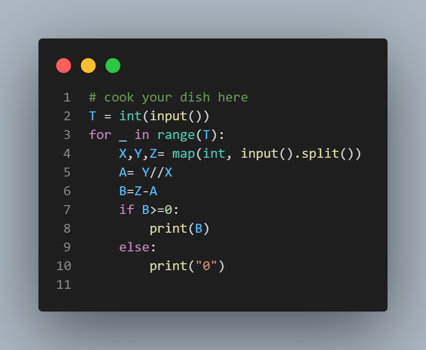

# Mario and Bullet

Mario's bullet moves at `X` pixels per frame. He wishes to shoot a goomba standing `Y` pixels away from him. The goomba does not move.

Find the minimum time (in seconds) after which Mario should shoot the bullet, such that it hits the goomba after at least `Z` seconds from now.

## Input Format
The first line of input will contain an integer `T`, the number of test cases. Then the test cases follow.
Each test case consists of a single line of input, containing three space-separated integers `X`, `Y`, and `Z`.

## Output Format
For each test case, output in a single line the minimum time (in seconds) after which Mario should shoot the bullet, such that it hits the goomba after at least `Z` seconds from now.

## Constraints
1 ≤ T ≤ 100
1 ≤ X, Y, Z ≤ 100
X divides Y

## Sample Input
```3
3 3 5
2 4 1
3 12 8
```

## sample output
```
4
0
4
```

## Explanation
- Test case 1: The speed of the bullet is 3 pixels per frame and the goomba is 3 pixels away from Mario. Thus, it would take 1 second for the bullet to reach the goomba. Mario wants the bullet to reach goomba after at least 5 seconds. So, he should fire the bullet after 4 seconds.
- Test case 2: The speed of the bullet is 2 pixels per frame and the goomba is 4 pixels away from Mario. Thus, it would take 2 seconds for the bullet to reach the goomba. Mario wants the bullet to reach the goomba after at least 1 second. So, he should fire the bullet after 0 seconds. Note that, this is the minimum time after which he can shoot a bullet.
- Test case 3: The speed of the bullet is 3 pixels per frame and the goomba is 12 pixels away from Mario. Thus, it would take 4 seconds for the bullet to reach the goomba. Mario wants the bullet to reach goomba after at least 8 seconds. So, he should fire the bullet after 4 seconds.


