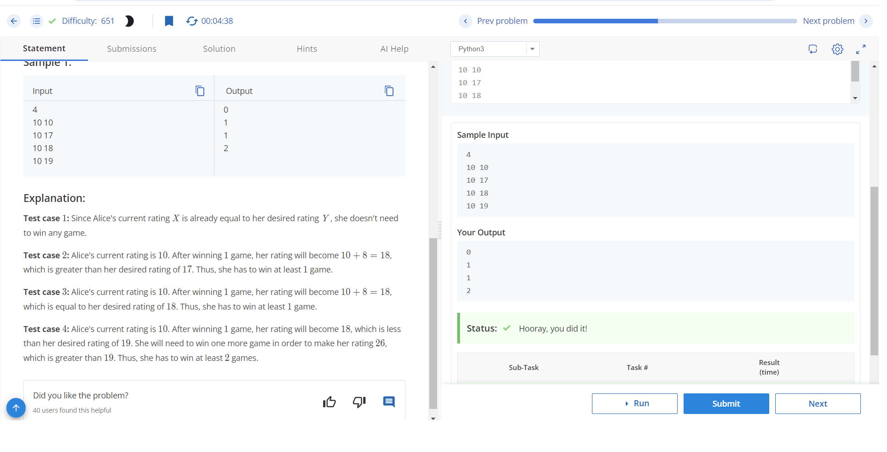
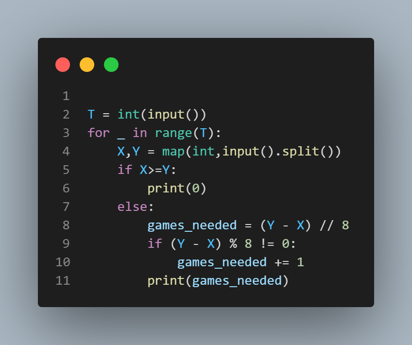

# Chess Ratings

Alice has recently started playing chess. Her current rating is `X`. She noticed that when she wins a game, her rating increases by 8 points.

This program helps Alice in finding out the minimum number of games she needs to win in order to make her rating greater than or equal to `Y`.

## Input Format
- The first line of input will contain an integer `T` — the number of test cases. The description of `T` test cases follows.
- The first line of each test case contains two integers `X` and `Y`, as described in the problem statement.

## Output Format
- For each test case, output the minimum number of games that Alice needs to win in order to make her rating greater than or equal to `Y`.

## Constraints
- 1 ≤ T ≤ 10^4
- 1 ≤ X ≤ Y ≤ 10^4

## Sample Input
```
4 
10 10
10 17
10 18
 10 19
 ```
## sample output
```
0
1
1
2```
## Explanation
- Test case 1: Alice's current rating `X` is already equal to her desired rating `Y`, so she doesn't need to win any game.
- Test case 2: Alice's current rating is 10. After winning 1 game, her rating will become 18, which is greater than her desired rating of 17. Thus, she has to win at least 1 game.
- Test case 3: Alice's current rating is 10. After winning 1 game, her rating will become 18, which is equal to her desired rating of 18. Thus, she has to win at least 1 game.
- Test case 4: Alice's current rating is 10. After winning 1 game, her rating will become 18, which is less than her desired rating of 19. She will need to win one more game in order to make her rating 26, which is greater than 19. Thus, she has to win at least 2 games.

