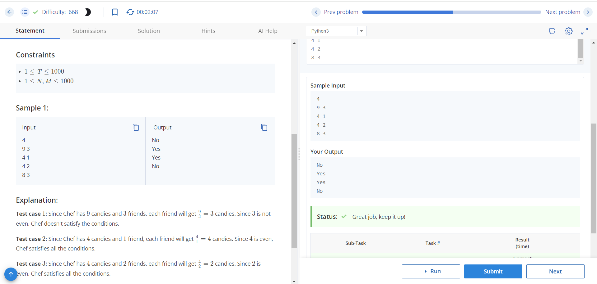
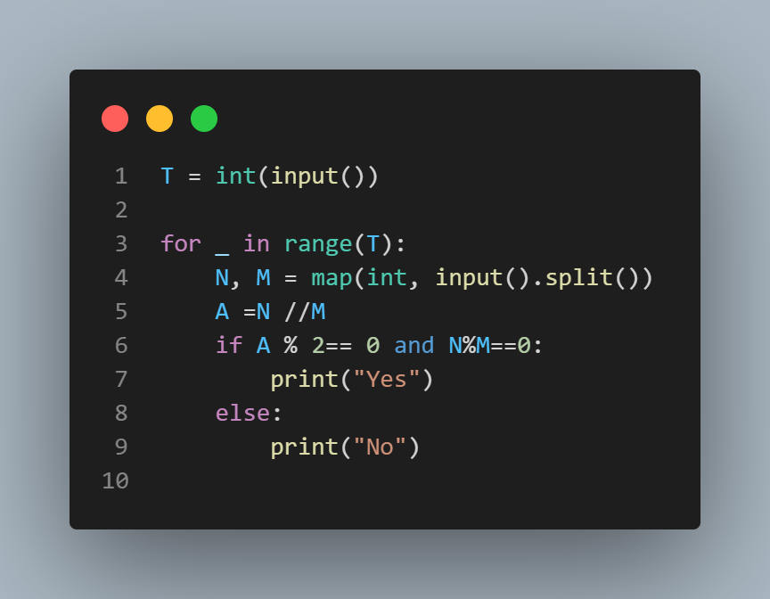

# Candy Distribution Problem

## Problem Description

Chef has **N** candies. He has to distribute them to exactly **M** of his friends such that each friend gets an equal number of candies, and each friend gets an even number of candies. Determine whether it is possible to do so.

**NOTE:** Chef will not take any candies himself and will distribute all the candies.

## Input Format

The input consists of multiple test cases. 
- The first line of input will contain **T**, the number of test cases.
- Each test case contains a single line of input with two integers **N** and **M**, representing the number of candies and the number of friends, respectively.

## Output Format

For each test case, the output will consist of a single line containing `Yes` if Chef can distribute the candies as per the conditions, and `No` otherwise. You may print each character of the string in uppercase or lowercase.

## Constraints
- 1 ≤ T ≤ 1000
- 1 ≤ N, M ≤ 1000

## Sample Input
```
4
9 3
4 1
4 2
8 3
```
## sample output
```
No
Yes
Yes
No

```
## Explanation
- Test case 1: Since Chef has 9 candies and 3 friends, each friend will get 9/3 = 3 candies. Since 3 is not even, Chef doesn't satisfy the conditions.
- Test case 2: Since Chef has 4 candies and 1 friend, each friend will get 4/1 = 4 candies. Since 4 is even, Chef satisfies all the conditions.
- Test case 3: Since Chef has 4 candies and 2 friends, each friend will get 4/2 = 2 candies. Since 2 is even, Chef satisfies all the conditions.
- Test case 4: Since Chef has 8 candies and 3 friends. Since Chef won't be able to distribute all the candies equally, Chef does not satisfy all the conditions.



