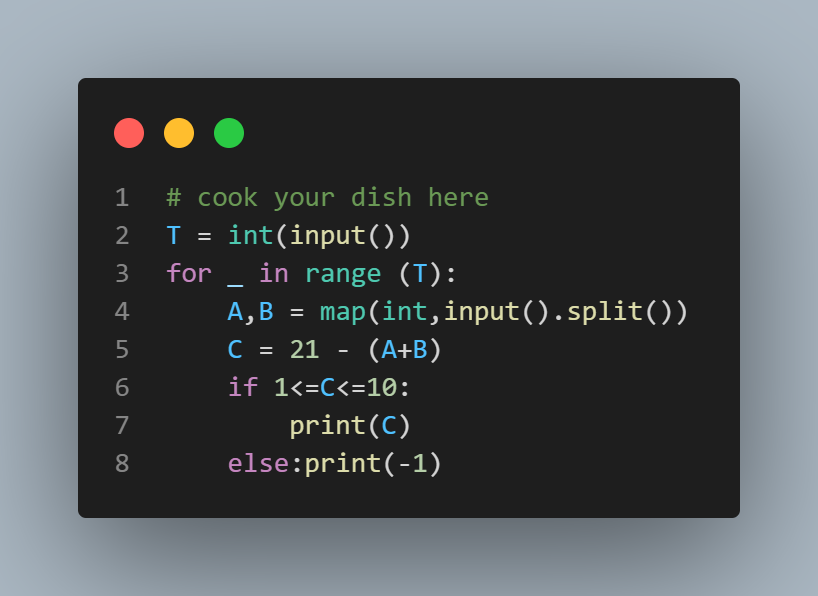

# Blackjack

## Problem Description

Chef is playing a variant of Blackjack, where 3 numbers are drawn and each number lies between 1 and 10 (inclusive). Chef wins the game when the sum of these 3 numbers is exactly 21.

Given the first two numbers **A** and **B** that have been drawn by Chef, what should be the 3rd number that should be drawn by Chef in order to win the game?

Note that it is possible that Chef cannot win the game, no matter what is the 3rd number. In such cases, report -1 as the answer.

## Input Format

The input consists of multiple test cases.
- The first line contains an integer **T**, the number of test cases.
- For each test case:
  - The first and only line contains two integers **A** and **B** - the first and second number drawn by Chef.

## Output Format

For each test case, output the 3rd number that should be drawn by the Chef in order to win the game. Output -1 if it is not possible for the Chef to win the game.

## Constraints
- 1 ≤ T ≤ 100
- 1 ≤ A, B ≤ 10

## Sample Input
```
3
1 10
1 5
4 9
```
## sample output 
```
10
-1
8
```

## Explanation:
- Test case 1: The first two numbers are 1 and 10. If the third number is also 10, the resulting sum will be 1 + 10 + 10 = 21. So Chef will win the game.
- Test case 2: The first two numbers are 1 and 5. There is no number between 1 and 10 that can make the resulting sum 21. Hence, the answer will be -1 in this test case.

Feel free to adjust the formatting or add more details if needed.


