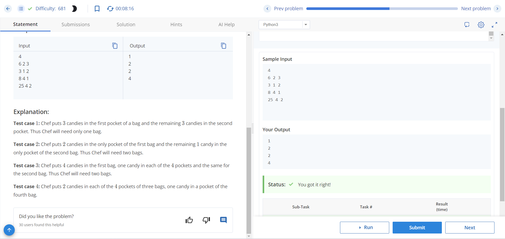

# Fill Candies

## Problem Description

Chef received **N** candies on his birthday. He wants to put these candies in some bags. A bag has **K** pockets, and each pocket can hold at most **M** candies. Find the minimum number of bags Chef needs so that he can put every candy into a bag.

## Input Format

The input consists of multiple test cases.
- The first line of input contains a single integer **T**, the number of test cases.
- For each test case:
  - There is a single line containing three space-separated integers **N**, **K**, and **M**.

## Output Format

For each test case, print the minimum number of bags Chef needs so that he can put all the candies in one of the bags.

## Constraints
- 1 ≤ T ≤ 1000
- 1 ≤ N, K, M ≤ 100

## Sample Input
```4
6 2 3
3 1 2
8 4 1
25 4 2
```
## sample output
```
1
2
2
4
```

## Explanation:
- Test case 1: Chef puts 3 candies in the first pocket of a bag and the remaining 3 candies in the second pocket. Thus Chef will need only one bag.
- Test case 2: Chef puts 2 candies in the only pocket of the first bag and the remaining 1 candy in the only pocket of the second bag. Thus Chef will need two bags.
- Test case 3: Chef puts 4 candies in the first bag, one candy in each of the 4 pockets, and the same for the second bag. Thus Chef will need two bags.
- Test case 4: Chef puts 2 candies in each of the 4 pockets of three bags, one candy in a pocket of the fourth bag.

Feel free to adjust the formatting or add more details if needed.



