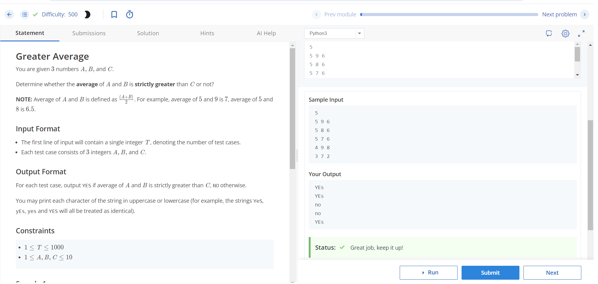
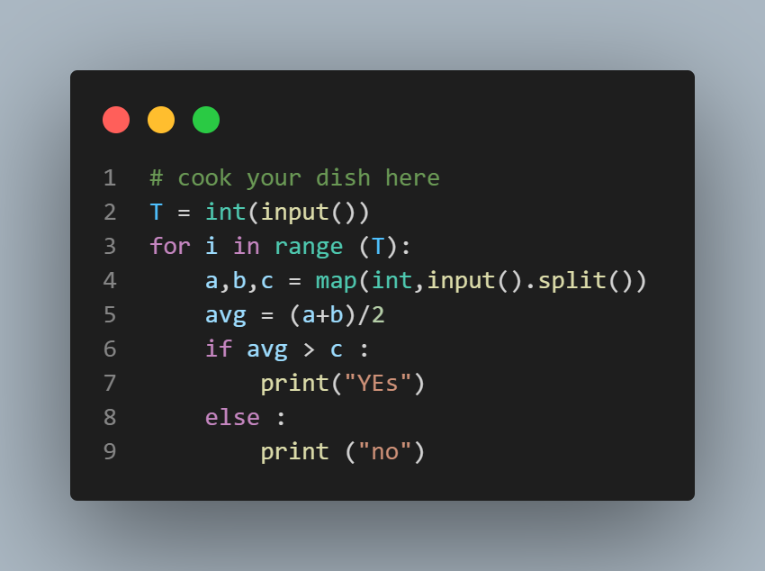

# Greater Average

## Problem Description

You are given 3 numbers A, B, and C. Determine whether the average of A and B is strictly greater than C or not.

- Average of A and B is defined as (A + B) / 2. For example, average of 5 and 9 is 7, average of 5 and 8 is 6.5.

### Input Format

The first line of input will contain a single integer T, denoting the number of test cases.
Each test case consists of 3 integers A, B, and C.

### Output Format

For each test case, output YES if average of A and B is strictly greater than C, NO otherwise.

### Constraints

- 1 ≤ T ≤ 1000
- 1 ≤ A, B, C ≤ 10

### Sample Input

```
5
5 9 6
5 8 6
5 7 6
4 9 8
3 7 2
```

### Sample Output

```
YES
YES
NO
NO
YES
```

## Explanation

- Test case 1: The average value of 5 and 9 is 7 which is strictly greater than 6.
- Test case 2: The average value of 5 and 8 is 6.5 which is strictly greater than 6.
- Test case 3: The average value of 5 and 7 is 6 which is not strictly greater than 6.
- Test case 4: The average value of 4 and 9 is 6.5 which is not strictly greater than 8.
- Test case 5: The average value of 3 and 7 is 5 which is strictly greater than 2.




