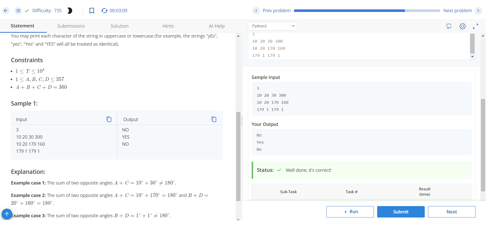
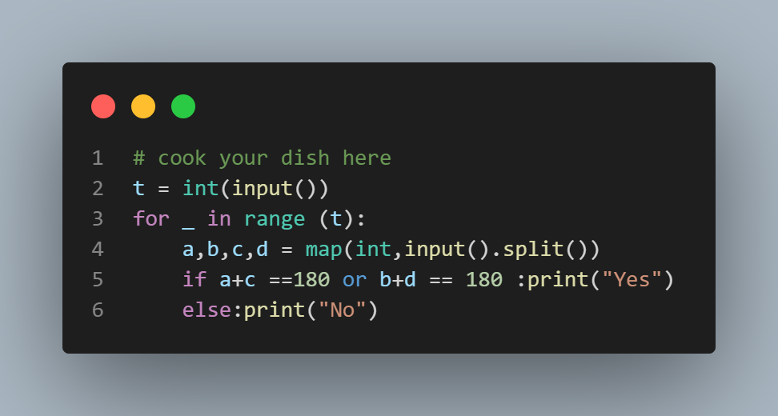

# Cyclic Quadrilateral

You are given the sizes of angles of a simple quadrilateral (in degrees) A, B, C, and D, in some order along its perimeter. Determine whether the quadrilateral is cyclic.

Note: A quadrilateral is cyclic if and only if the sum of opposite angles is 180°.

## Input Format

The first line of the input contains a single integer T denoting the number of test cases. The description of T test cases follows.
The first and only line of each test case contains four space-separated integers A, B, C, and D.

## Output Format

Print a single line containing the string "YES" if the given quadrilateral is cyclic or "NO" if it is not (without quotes).

You may print each character of the string in uppercase or lowercase (for example, the strings "yEs", "yes", "Yes" and "YES" will all be treated as identical).

## Constraints

- 1 ≤ T ≤ 10^4
- 1 ≤ A, B, C, D ≤ 357
- A + B + C + D = 360

## Sample Input

```
3
10 20 30 300
10 20 170 160
179 1 179 1

```
## Sample output 

```

NO
YES
NO

```

## Explanation

- Example case 1: The sum of two opposite angles A + C = 10° + 30° ≠ 180°.
- Example case 2: The sum of two opposite angles A + C = 10° + 170° = 180° and B + D = 20° + 160° = 180°.
- Example case 3: The sum of two opposite angles B + D = 1° + 1° ≠ 180°.


