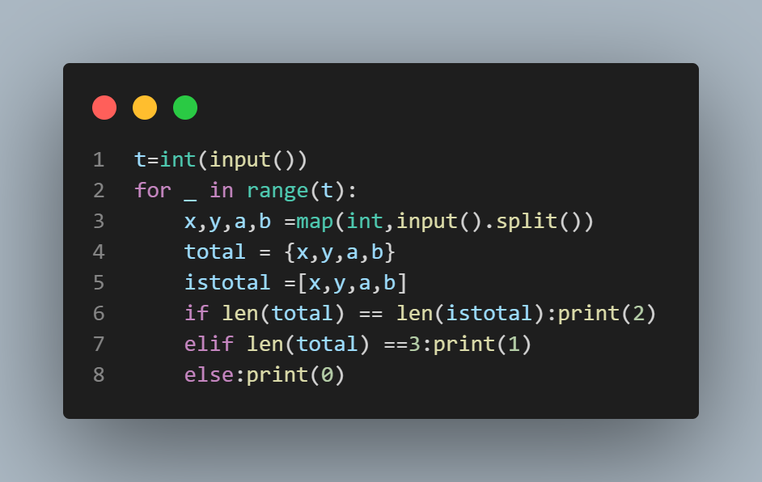

# Chef and Races

## Problem Statement
Chef is participating in the National Championships, which have 4 race categories numbered from 1 to 4. Chef's arch-rival, who is better than Chef, is participating in exactly 2 of these categories. Chef hopes to not fall into the same categories as that of the arch-rival. Given Chef's races and his arch-rival's races, find the maximum number of gold medals Chef can win.

## Input Format
- The first line of input contains an integer T, denoting the number of testcases.
- Each of the next T lines contains four space-separated integers: X, Y, A, and B.

## Output Format
- For each testcase, print a single integer representing the maximum number of gold medals Chef can win.

## Constraints
- 1 ≤ T ≤ 144
- 1 ≤ X, Y, A, B ≤ 4
- X ≠ Y, A ≠ B

## Sample Input
```
3
4 3 1 2
4 2 1 2
2 1 1 2
```

## sample output
```
2
0
1
```


## Explanation
- In the first testcase, Chef can win the gold medals in both races.
- In the second testcase, Chef can win one gold medal.
- In the third testcase, Chef cannot win any gold medals.


