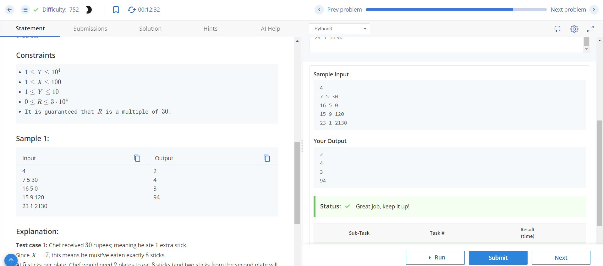

# Endless Appetizers Problem Solution

## Problem Statement
Life is like a box of mozzarella sticks. Chef's colleague issued a challenge to Chef: eat more than X mozzarella sticks and receive 30 rupees for each extra one eaten. Given the lower limit on the number of sticks, the number of sticks per plate, and the money received by Chef, find the maximum number of plates of mozzarella sticks Chef could have ordered.

## Input Format
- The first line of input contains a single integer T, denoting the number of test cases.
- Each test case consists of one line of input containing three space-separated integers: L (lower limit on the number of sticks), X (number of sticks on a single plate), and R (the money received by Chef).

## Output Format
For each test case, output on a new line the answer: the maximum number of plates Chef could have ordered.

## Constraints
- 1 ≤ T ≤ 10^4
- 1 ≤ L ≤ 100
- 1 ≤ X ≤ 100
- 1 ≤ Y ≤ 10
- 0 ≤ R ≤ 3 * 10^4
- R is a multiple of 30

## Sample Input

```
4
7 5 30
16 5 0
15 9 120
23 1 2130

```

## sample output

```
2
4
3
94


```

## Explanation
- Test case 1: Chef received 30 rupees, meaning he ate 1 extra stick. Since X=7, he must've eaten exactly 8 sticks. At 5 sticks per plate, Chef would need 2 plates to eat 8 sticks.
- Test case 2: Chef received 0 rupees. Since X=16, he ate ≤ 16 sticks. The maximum he could've eaten is exactly 16; and this would require 4 plates since each plate has 5 sticks.
- Test case 3: Chef received 120 rupees, meaning he ate 4 extra sticks. This makes for a total of 19 sticks, and at 9 sticks per plate, he would need 3 plates.
- Test case 4: Chef received 2130 rupees, meaning he ate 71 extra sticks. This makes for a total of 94 sticks, and at 1 stick per plate, he would need 94 plates.


