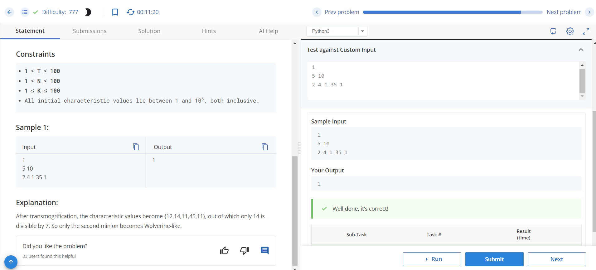

# Mutated Minions

## Problem Description
Gru has built a transmogrifier machine which mutates minions. Each minion has an intrinsic characteristic value (similar to DNA), which is an integer. The transmogrifier adds an integer K to each of the minions' characteristic values. If the new characteristic value of a minion is divisible by 7, then it will have Wolverine-like mutations. Given the initial characteristic integers of N minions and the value of K, find out how many of them become Wolverine-like after transmogrification.

## Input Format
- The first line contains an integer T, which is the number of test cases.
- Each test case consists of two lines:
  - The first line contains two integers N and K, denoting the number of minions and the value added by the transmogrifier, respectively.
  - The second line contains N integers, which denote the initial characteristic values for the minions.

## Output Format
- For each test case, output one integer in a new line, which is the number of Wolverine-like minions after the transmogrification.

## Constraints
- 1 ≤ T ≤ 100
- 1 ≤ N ≤ 100
- 1 ≤ K ≤ 100
- All initial characteristic values lie between 1 and 10^5, both inclusive.

## Sample Input
```
1
5 10
2 4 1 35 1
```

## sample output
```
1
```

## Explanation
After transmogrification, the characteristic values become {12, 14, 11, 45, 11}, out of which only 14 is divisible by 7. So only the second minion becomes Wolverine-like.
