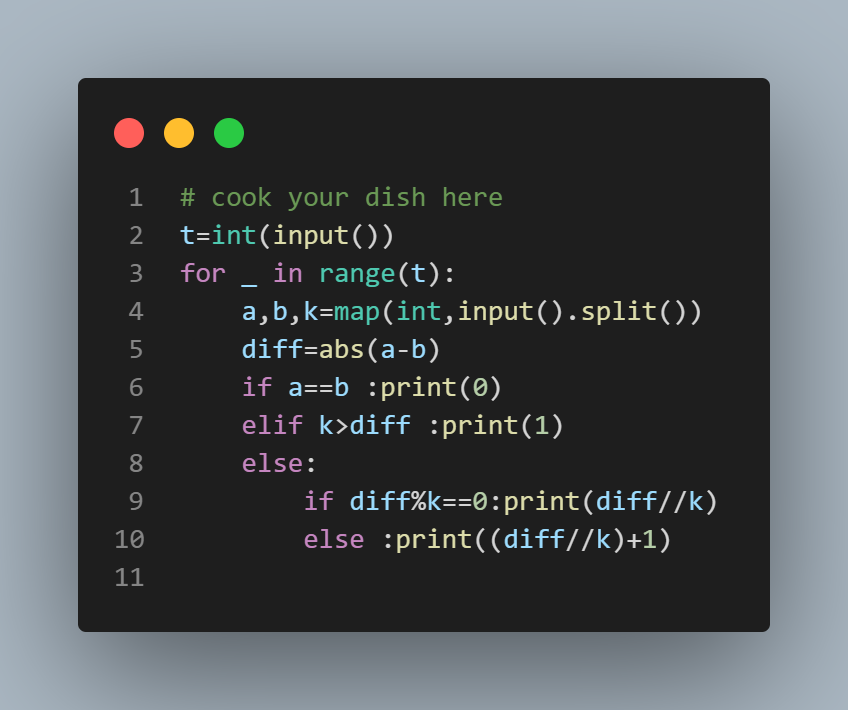

# Reach Fast

## Problem Description
Chef is standing at coordinate A while Chefina is standing at coordinate B. In one step, Chef can increase or decrease his coordinate by at most K. Determine the minimum number of steps required by Chef to reach Chefina.

## Input Format
- The first line of input contains a single integer T, denoting the number of test cases.
- Each test case consists of three integers X, Y, and K, representing the initial coordinate of Chef, the initial coordinate of Chefina, and the maximum number of coordinates Chef can move in one step.

## Output Format
- For each test case, output the minimum number of steps required by Chef to reach Chefina.

## Constraints
- 1 ≤ T ≤ 1000
- 1 ≤ X, Y ≤ 100
- 1 ≤ K ≤ 100

## Sample Input
```
4
10 20 3
36 36 5
50 4 100
30 4 2
```

## sample output 
```
4
0
1
13
```

## Explanation
- Test case 1: In the first three steps, Chef increases his coordinate by K = 3. In the fourth step, Chef increases his coordinate by 1, which is less than or equal to K. It can be shown that this is the minimum number of steps required by Chef.
- Test case 2: Chef is already at the same coordinate as Chefina. Thus, he needs 0 steps.
- Test case 3: Chef can use 1 step to decrease his coordinate by 46 which is less than or equal to K = 100 and reach Chefina.
- Test case 4: Chef can use 13 steps to decrease his coordinate by K = 2 and reach the coordinate 30 - 13 * 2 = 4.

