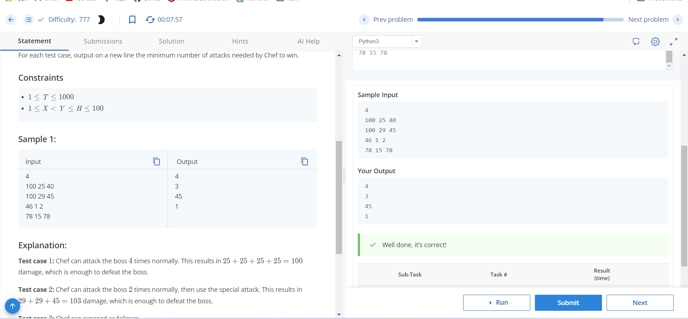
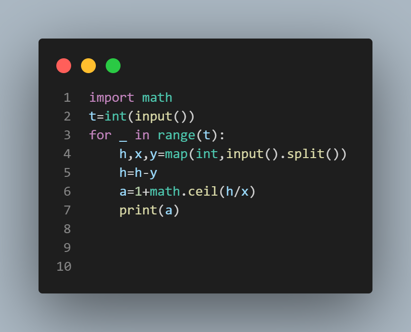

# Single-use Attack

## Problem Description
Chef is playing a video game and is now fighting the final boss. The boss has H health points. Each attack of Chef reduces the health of the boss by X. Chef also has a special attack that can be used at most once and will decrease the health of the boss by Y. Chef wins when the health of the boss is ≤ 0. What is the minimum number of attacks needed by Chef to win?

## Input Format
- The first line of input contains a single integer T, denoting the number of test cases.
- Each test case consists of a single line containing three space-separated integers H, X, and Y.

## Output Format
- For each test case, output on a new line the minimum number of attacks needed by Chef to win.

## Constraints
- 1 ≤ T ≤ 1000
- 1 ≤ X < Y ≤ H ≤ 100

## Sample Input
```
4
100 25 40
100 29 45
46 1 2
78 15 78
```
## Sample output

```
4
3
45
1
```
## Explanation
- Test case 1: Chef can attack the boss 4 times normally. This results in 25 + 25 + 25 + 25 = 100 damage, which is enough to defeat the boss.
- Test case 2: Chef can attack the boss 2 times normally, then use the special attack. This results in 29 + 29 + 45 = 103 damage, which is enough to defeat the boss.
- Test case 3: Chef can use the special attack to reduce the boss's health to 44, then use 44 normal attacks to defeat the boss. This takes a total of 44 + 1 = 45 attacks.
- Test case 4: Chef can use the special attack to immediately bring the health of the boss to zero, hence only needing one attack.

