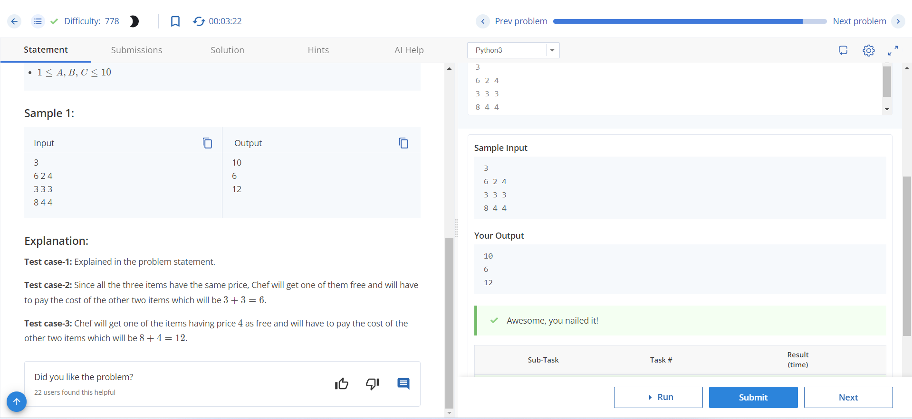

# Get Lowest Free

## Problem Description
Chef goes to the supermarket to buy some items. Luckily, there's a sale going on under which Chef gets the following offer: If Chef buys 3 items, then he gets the item (out of those 3 items) having the lowest price as free. Chef buys 3 items having prices A, B, and C respectively. What is the amount of money Chef needs to pay?

## Input Format
- The first line contains an integer T, the number of test cases.
- Each test case contains three integers A, B, and C, the prices of the items bought by Chef.

## Output Format
- For each test case, output the price paid by Chef.

## Constraints
- 1 ≤ T ≤ 100
- 1 ≤ A, B, C ≤ 10

## Sample Input

```
3
6 2 4
3 3 3
8 4 4

```
## Sample output

```
10
6
12
```
## Explanation
- Test case 1: Chef buys 3 items with prices 6, 2, and 4. He will get the item with price 2 as free, so he needs to pay 6 + 4 = 10.
- Test case 2: Since all three items have the same price, Chef will get one of them free and will have to pay the cost of the other two items, which will be 3 + 3 = 6.
- Test case 3: Chef will get one of the items having a price of 4 as free and will have to pay the cost of the other two items, which will be 8 + 4 = 12.

