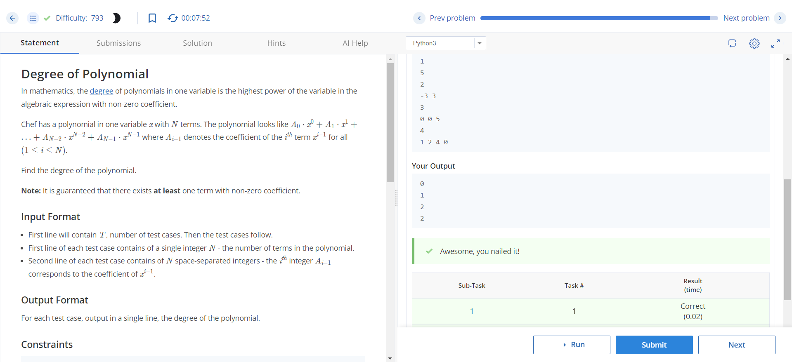

# Degree of Polynomial

## Problem Description

Chef has a polynomial in one variable x with N terms. The polynomial looks like A0⋅x0 + A1⋅x1 + … + AN−2⋅xN−2 + AN−1⋅xN−1 where Ai denotes the coefficient of the ith term xi for all (1 ≤ i ≤ N).

Find the degree of the polynomial.

## Input Format

- The first line of the input will contain a single integer T, the number of test cases.
- For each test case:
  - The first line contains a single integer N, the number of terms in the polynomial.
  - The second line contains N space-separated integers, the ith integer Ai corresponds to the coefficient of xi.

## Output Format

For each test case, output in a single line, the degree of the polynomial.

## Constraints

- 1 ≤ T ≤ 100
- 1 ≤ N ≤ 1000
- -1000 ≤ Ai ≤ 1000
- Ai ≠ 0 for at least one (0 ≤ i < N).

## Sample Input
```
4
1
5
2
-3 3
3
0 0 5
4
1 2 4 0
0

```
## Sample output

```
0
1
2
2
```


## Explanation

- Test case 1: There is only one term A0x0 with coefficient 5. Thus, we are given a constant polynomial and the degree is 0.
- Test case 2: The polynomial is -3⋅x0 + 3⋅x1 = -3+3⋅x. Thus, the highest power of x with non-zero coefficient is 1.
- Test case 3: The polynomial is 0⋅x0 + 0⋅x1 + 5⋅x2 = 0+0+5⋅x2. Thus, the highest power of x with non-zero coefficient is 2.
- Test case 4: The polynomial is 1⋅x0 + 2⋅x1 + 4⋅x2 + 0⋅x3 = 1+2⋅x+4⋅x2. Thus, the highest power of x with non-zero coefficient is 2.

