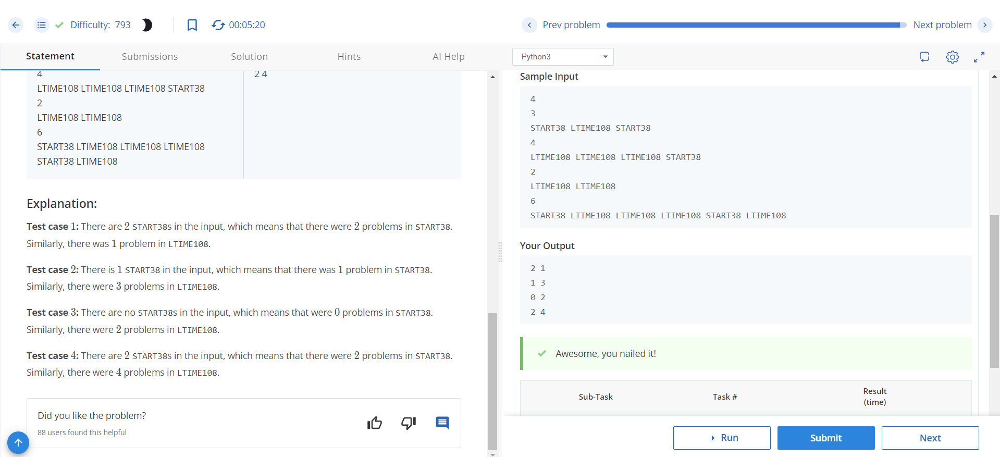

# Recent Contest Problems

CodeChef recently revamped its practice page to make it easier for users to identify the next problems they should solve by introducing some new features:

- **Recent Contest Problems**: Contains only problems from the last 2 contests
- **Separate Un-Attempted, Attempted, and All tabs**
- **Problem Difficulty Rating**: The Recommended dropdown menu has various difficulty ranges so that you can attempt the problems most suited to your experience
- **Popular Topics and Tags**

Chef has been participating regularly in rated contests but missed the last two contests due to his college exams. He now wants to solve them and so he visits the practice page to view these problems.

## Input Format

- First line will contain `T`, number of test cases. Then the test cases follow.
- Each test case contains of two lines of input.
- First line of input contains the total count of problems that appeared in the two recent contests - `N`.
- Second line of input contains the list of `N` contest codes. Each code is either `START38` or `LTIME108`, to which each problem belongs.

## Output Format

For each test case, output two integers in a single new line - the first integer should be the number of problems in `START38`, and the second integer should be the number of problems in `LTIME108`.

## Constraints

- 1 ≤ T ≤ 10
- 1 ≤ N ≤ 1000
- Each of the contest codes will be either `START38` or `LTIME108`.

## Sample Input
```

To create a README file in Markdown format, you can follow these steps:

Open a text editor or a Markdown editor.
Write the content of your README file using Markdown syntax.
Save the file with the extension ".md".
Here's an example of how your README.md file could look for the problem "Recent contest problems":

markdown
Copy code
# Recent Contest Problems

CodeChef recently revamped its practice page to make it easier for users to identify the next problems they should solve by introducing some new features:

- **Recent Contest Problems**: Contains only problems from the last 2 contests
- **Separate Un-Attempted, Attempted, and All tabs**
- **Problem Difficulty Rating**: The Recommended dropdown menu has various difficulty ranges so that you can attempt the problems most suited to your experience
- **Popular Topics and Tags**

Chef has been participating regularly in rated contests but missed the last two contests due to his college exams. He now wants to solve them and so he visits the practice page to view these problems.

## Input Format

- First line will contain `T`, number of test cases. Then the test cases follow.
- Each test case contains of two lines of input.
- First line of input contains the total count of problems that appeared in the two recent contests - `N`.
- Second line of input contains the list of `N` contest codes. Each code is either `START38` or `LTIME108`, to which each problem belongs.

## Output Format

For each test case, output two integers in a single new line - the first integer should be the number of problems in `START38`, and the second integer should be the number of problems in `LTIME108`.

## Constraints

- 1 ≤ T ≤ 10
- 1 ≤ N ≤ 1000
- Each of the contest codes will be either `START38` or `LTIME108`.

## Sample Input

4
3
START38 LTIME108 START38
4
LTIME108 LTIME108 LTIME108 START38
2
LTIME108 LTIME108
6
START38 LTIME108 LTIME108 LTIME108 START38 LTIME108
```
## sample output
```
2 1
1 3
0 2
2 4
```

