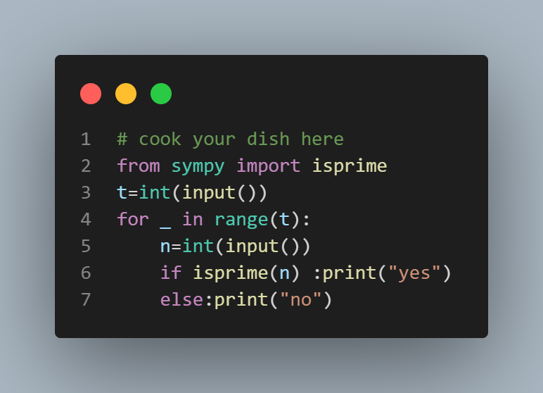

# Primality Test

Alice and Bob are meeting after a long time. As usual they love to play some math games. This time Alice takes the call and decides the game. The game is very simple, Alice says out an integer and Bob has to say whether the number is prime or not. Bob as usual knows the logic but since Alice doesn't give Bob much time to think, so Bob decides to write a computer program.

Help Bob accomplish this task by writing a computer program which will calculate whether the number is prime or not.

## Input

The first line of the input contains an integer T, the number of test cases. T lines follow.

Each of the next T lines contains an integer N which has to be tested for primality.

## Output

For each test case output in a separate line, "yes" if the number is prime else "no."

## Constraints

- 1 ≤ T ≤ 20
- 1 ≤ N ≤ 100000

## Sample Input
```
5
23
13
20
1000
99991
```
## Sample output
```
yes
yes
no
no
yes
```



