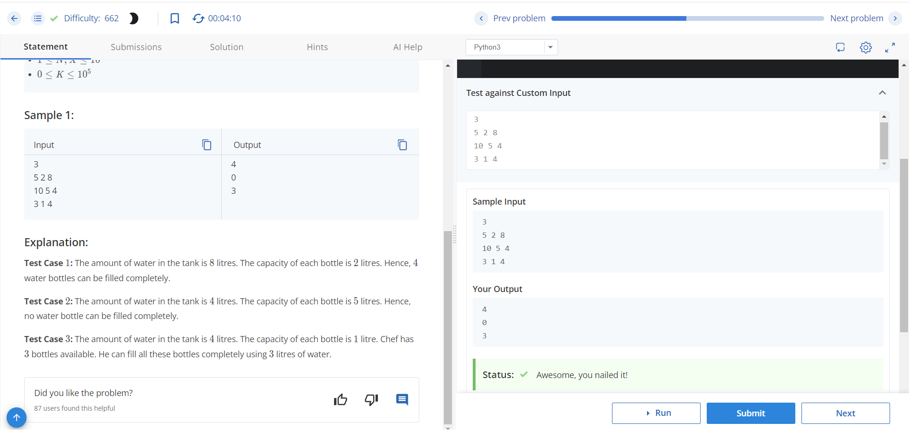
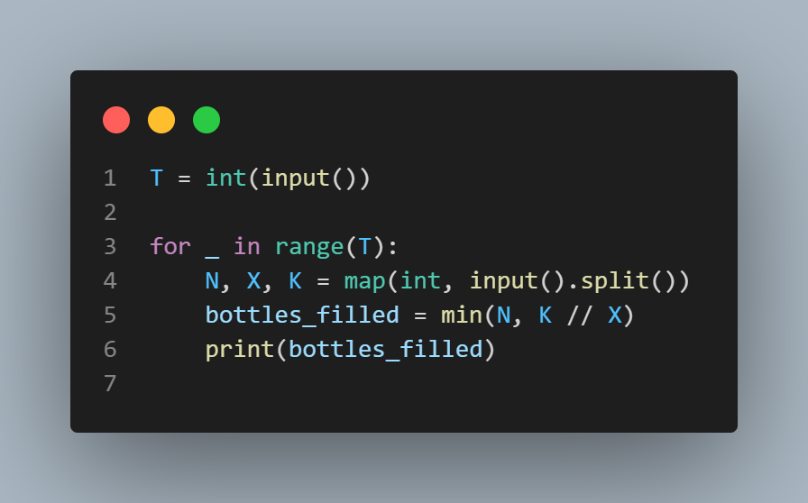

# Chef and Water Bottles

## Problem Description

Chef has **N** empty bottles where each bottle has a capacity of **X** litres. There is a water tank in Chefland having **K** litres of water. Chef wants to fill the empty bottles using the water in the tank. Assuming that Chef does not spill any water while filling the bottles, find out the maximum number of bottles Chef can fill completely.

## Input Format

The input consists of multiple test cases.
- The first line of input will contain **T**, the number of test cases.
- Each test case contains a single line of input with three integers **N**, **X**, and **K**, representing the number of bottles, the capacity of each bottle, and the amount of water in the tank, respectively.

## Output Format

For each test case, output in a single line the answer, the maximum number of bottles Chef can fill completely.

## Constraints
- 1 ≤ T ≤ 100
- 1 ≤ N, X ≤ 10^5
- 0 ≤ K ≤ 10^5

## Sample Input
```
3
5 2 8 
10 5 4
3 1 4 
```
## sample output 
```
4
0
3
```

## Explanation
- Test Case 1: The amount of water in the tank is 8 litres. The capacity of each bottle is 2 litres. Hence, 4 water bottles can be filled completely.
- Test Case 2: The amount of water in the tank is 4 litres. The capacity of each bottle is 5 litres. Hence, no water bottle can be filled completely.
- Test Case 3: The amount of water in the tank is 4 litres. The capacity of each bottle is 1 litre. Chef has 3 bottles available. He can fill all these bottles completely using 3 litres of water.


