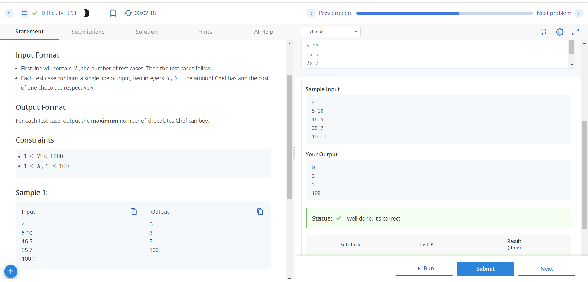
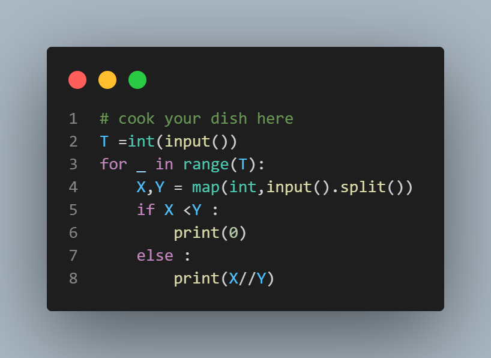

# Valentine is Coming

Valentine's Day is approaching, and Chef wants to buy some chocolates for someone special.

Chef has a total of X rupees, and one chocolate costs Y rupees. What is the maximum number of chocolates Chef can buy?

## Input Format
- First line: Number of test cases, T
- Next T lines: Two space-separated integers X and Y - the amount Chef has and the cost of one chocolate respectively.

## Output Format
For each test case, output the maximum number of chocolates Chef can buy.

## Constraints
- 1 ≤ T ≤ 1000
- 1 ≤ X, Y ≤ 100

## Sample Input
```
4
5 10
16 5
35 7
100 1
```

## sample output 
```
0
3
5
100
```

## Explanation
- Test case 1: Chef has 5 rupees, but the cost of one chocolate is 10 rupees. Therefore, Chef cannot buy any chocolates.
- Test case 2: Chef has 16 rupees, and the cost of one chocolate is 5 rupees. Therefore, Chef can buy at most 3 chocolates since buying 4 chocolates would cost 20 rupees.
- Test case 3: Chef has 35 rupees, and the cost of one chocolate is 7 rupees. Therefore, Chef can buy at most 5 chocolates for 35 rupees.
- Test case 4: Chef has 100 rupees, and the cost of one chocolate is 1 rupee. Therefore, Chef can buy at most 100 chocolates for 100 rupees.
 
 
