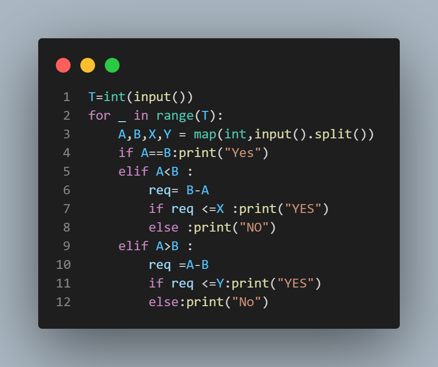

# Water Mixing for Perfect Bath

## Problem Statement
Chef is setting up a perfect bath for himself. He has X litres of hot water and Y litres of cold water. The initial temperature of water in his bathtub is A degrees. On mixing water, the temperature of the bathtub changes as follows:
- The temperature rises by 1 degree on mixing 1 litre of hot water.
- The temperature drops by 1 degree on mixing 1 litre of cold water.
Determine whether he can set the temperature to B degrees for a perfect bath.

## Input Format
- The first line of input contains a single integer T, denoting the number of test cases.
- Each test case consists of four space-separated integers A, B, X, and Y — the initial temperature of the bathtub, the desired temperature of the bathtub, the amount of hot water in litres, and the amount of cold water in litres respectively.

## Output Format
- For each test case, output on a new line, YES if Chef can get the desired temperature for his bath, and NO otherwise.

## Constraints
- 1 ≤ T ≤ 2000
- 20 ≤ A, B ≤ 40
- 0 ≤ X, Y ≤ 20

## Sample Input
```4
24 25 2 0
37 37 2 9 
30 20 10 9
30 31 0 20
```
## sample output
```
YES 
YES
NO 
NO
```


## Explanation
- Test case 1: Chef can add 1 litre hot water in the tub and change the temperature to 24 + 1 = 25 degrees.
- Test case 2: Chef does not need to add any more water in the bathtub as the initial temperature and desired temperature are the same.
- Test case 3: Chef needs to add 10 litres of cold water to reach the desired temperature. Since he only has 9 litres of cold water, he cannot reach the desired temperature.
- Test case 4: Chef needs to add 1 litre of hot water to reach the desired temperature. Since he has no hot water, he cannot reach the desired temperature.


