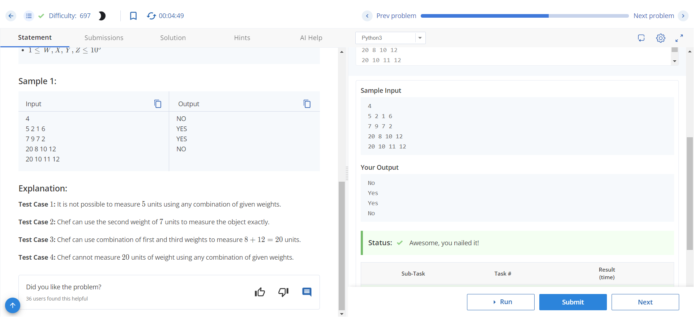

# Weight Measurement

## Problem Statement
Chef is playing with weights. He has an object weighing W units. He also has three weights each of X, Y, and Z units respectively. The task is to determine whether he can measure the exact weight of the object with one or more of these weights.

If it is possible to measure the weight of the object with one or more of these weights, print YES. Otherwise, print NO.

## Input Format
- The first line of input contains a single integer T, denoting the number of test cases.
- Each test case consists of a single line containing four positive integers W, X, Y, and Z.

## Output Format
- For each test case, output on a new line YES if it is possible to measure the weight of the object with one or more of these weights, otherwise print NO.

## Constraints
- 1 ≤ T ≤ 10^4
- 1 ≤ W, X, Y, Z ≤ 10^5

## Sample Input
```
4
5 2 1 6
7 9 7 2
20 8 10 12
20 10 11 12

```
## sample output
```
NO
YES
YES
NO

```

## Explanation
- Test Case 1: It is not possible to measure 5 units using any combination of given weights.
- Test Case 2: Chef can use the second weight of 7 units to measure the object exactly.
- Test Case 3: Chef can use a combination of the first and third weights to measure 8 + 12 = 20 units.
- Test Case 4: Chef cannot measure 20 units of weight using any combination of given weights.



