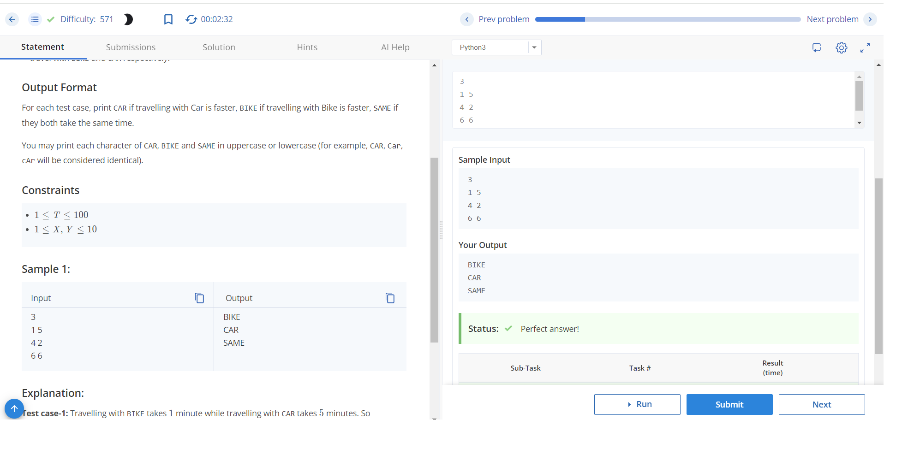
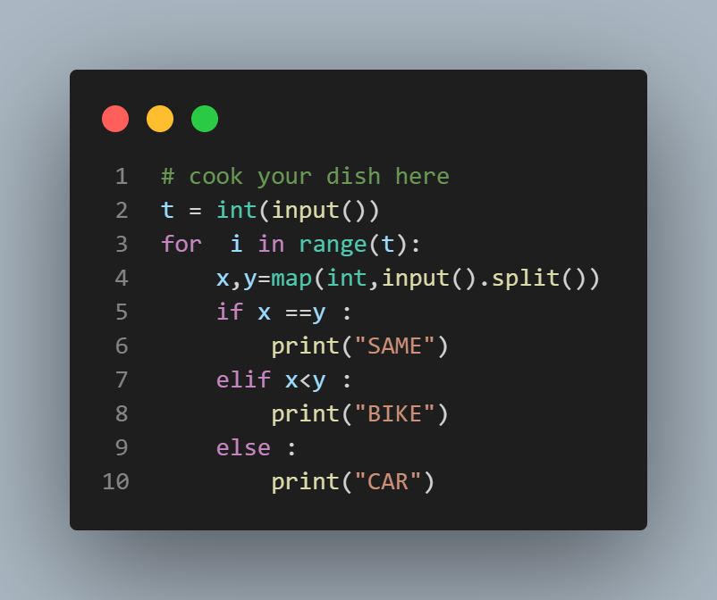

# Car or Bike Speed Comparison

Chef wants to reach home as soon as possible. He has two options: traveling with his bike or his car. Given the time it takes to travel with each option, this program determines which option is faster or if they both take the same time.

## Input Format

- The first line contains an integer T, the number of test cases.
- For each test case, there is a single line of input containing two integers X and Y, representing the time taken to travel with the bike and car respectively.

## Output Format

For each test case, the program outputs:
- "CAR" if traveling with the car is faster.
- "BIKE" if traveling with the bike is faster.
- "SAME" if both options take the same time.

## Constraints

- 1 ≤ T ≤ 100
- 1 ≤ X, Y ≤ 10

## Sample Input

```
3
15
42
66

```
# sample Output

```
BIKE 
CAR
SAME

```


## Explanation

- Test case 1: Traveling with the bike takes 1 minute while traveling with the car takes 5 minutes. So traveling with the bike is faster.
- Test case 2: Traveling with the bike takes 4 minutes while traveling with the car takes 2 minutes. So traveling with the car is faster.
- Test case 3: Traveling with both the bike and car takes the same time, which is 6 minutes.



