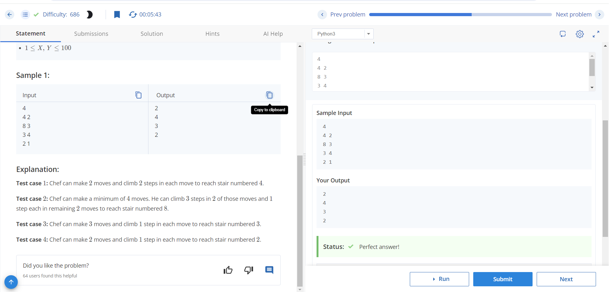

# X Jumps

Chef is currently standing at stair 0 and he wants to reach stair numbered X.

Chef can climb either Y steps or 1 step in one move. Find the minimum number of moves required by him to reach exactly the stair numbered X.

## Input Format
The first line of input will contain a single integer T, denoting the number of test cases.
Each test case consists of a single line of input containing two space-separated integers X and Y denoting the number of stairs Chef wants to reach and the number of stairs he can climb in one move.

## Output Format
For each test case, output the minimum number of moves required by him to reach exactly the stair numbered X.

## Constraints
1 ≤ X ≤ 500
1 ≤ T ≤ 500
1 ≤ X, Y ≤ 100

## Sample Input
```
4
4 2
8 3
3 4
2 1
```
## sample output
```
2
3
3
2
```

## Explanation
- Test case 1: Chef can make 2 moves and climb 2 steps in each move to reach stair numbered 4.
- Test case 2: Chef can make a minimum of 3 moves. He can climb 3 steps in 2 of those moves and 1 step each in the remaining 2 moves to reach stair numbered 8.
- Test case 3: Chef can make 3 moves and climb 1 step in each move to reach stair numbered 3.
- Test case 4: Chef can make 2 moves and climb 1 step in each move to reach stair numbered 2.




