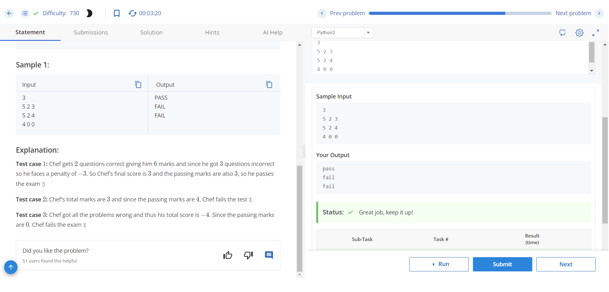

# Pass or Fail

Chef is struggling to pass a certain college course. The test has a total of N questions, each question carries 3 marks for a correct answer and -1 for an incorrect answer. Chef is a risk-averse person so he decided to attempt all the questions. It is known that Chef got X questions correct and the rest of them incorrect. For Chef to pass the course he must score at least P marks.

This program determines whether Chef will be able to pass the exam or not.

## Input Format

The first line contains an integer T, the number of test cases. Then the test cases follow.
Each test case contains a single line of input with three integers N, X, and P.

## Output Format

For each test case, the program outputs "PASS" if Chef passes the exam and "FAIL" if Chef fails the exam.

You may print each character of the string in uppercase or lowercase (for example, the strings "pASs", "pass", "Pass" and "PASS" will all be treated as identical).

## Constraints

- 1 ≤ T ≤ 1000
- 1 ≤ N ≤ 100
- 0 ≤ X ≤ N
- 0 ≤ P ≤ 3 * N

## Sample Input
 
```
3
5 2 3
5 2 4
4 0 0

```
## sample output

```
PASS
FAIL
FAIL


```


## Explanation

- Test case 1: Chef gets 2 questions correct, giving him 6 marks, and since he got 3 questions incorrect, he faces a penalty of -3. So Chef's final score is 3, and the passing marks are also 3, so he passes the exam.
- Test case 2: Chef's total marks are 3, and since the passing marks are 4, Chef fails the test.
- Test case 3: Chef got all the problems wrong, and thus his total score is -4. Since the passing marks are 0, Chef fails the exam.

