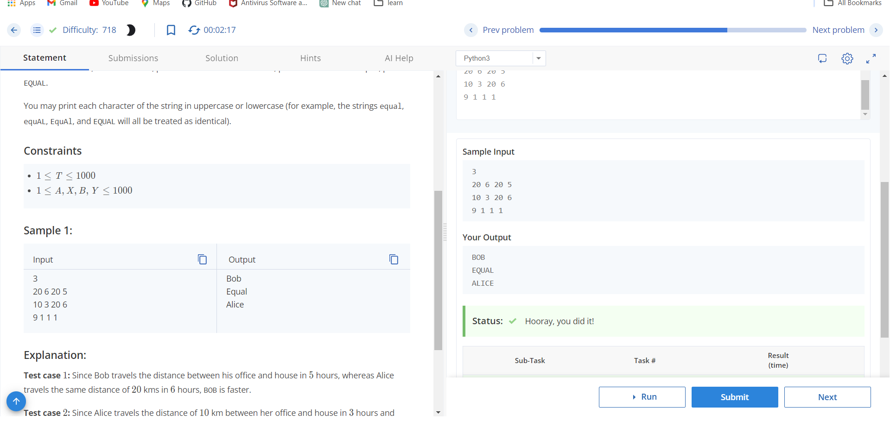
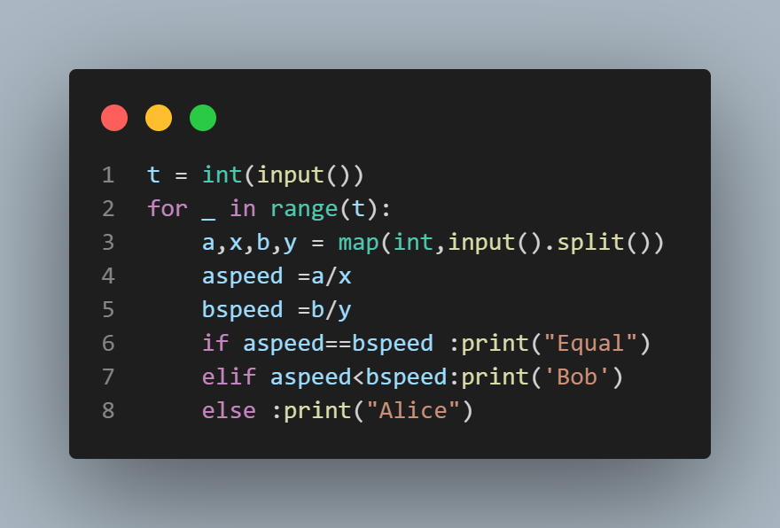

# Speed Limit Test

## Problem Description
Alice and Bob are driving from their homes to their offices. Alice's office is A kilometers away and it takes her X hours to reach. Bob's office is B kilometers away and it takes him Y hours to reach. Determine who is driving faster, or if they are both driving at the same speed.

## Input Format
- The first line contains an integer T, the number of test cases.
- Each of the next T lines contains four integers A, X, B, and Y, the distances and the times taken by Alice and Bob respectively.

## Output Format
- For each test case, if Alice is faster, print "ALICE". If Bob is faster, print "BOB". If both are equal, print "EQUAL".

## Constraints
- 1 ≤ T ≤ 1000
- 1 ≤ A, X, B, Y ≤ 1000

## Sample Input
```
3
20 6 20 5
10 3 20 6
9 1 1 1
```

## Sample Output
```
BOB
EQUAL
ALICE
```


## Explanation
- Test Case 1: Bob travels the distance between his office and home in 5 hours, whereas Alice travels the same distance in 6 hours, so BOB is faster.
- Test Case 2: Alice travels 10 km in 3 hours and Bob travels 20 km in 6 hours, so they have equal speeds.
- Test Case 3: Alice travels 9 km in 1 hour and Bob travels only 1 km in the same time, so ALICE is faster.


