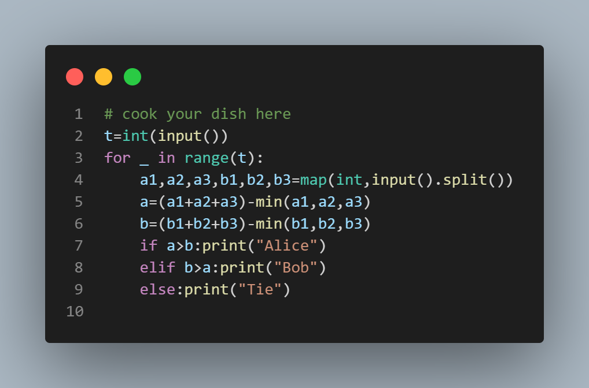

# Best of Two

## Problem Description
Alice and Bob are playing a game. Each player rolls a regular six-faced dice 3 times. The score of a player is the sum of the values of the highest 2 rolls. The player with the highest score wins, and the game ends in a Tie if both players have the same score.

Find the winner of the game or determine whether it is a tie.

## Input Format
- The first line of input contains a single integer T, denoting the number of test cases.
- Each test case contains six space-separated integers A1, A2, A3, B1, B2, and B3 — the values Alice gets in her 3 dice rolls, followed by the values Bob gets in his 3 dice rolls.

## Output Format
For each test case, output on a new line Alice if Alice wins, Bob if Bob wins, and Tie in case of a tie.

Note that you may print each character in uppercase or lowercase. For example, the strings tie, TIE, Tie, and tIe are considered identical.

## Constraints
- 1 ≤ T ≤ 10^4
- 1 ≤ Ai, Bi ≤ 6 (where 1 ≤ i ≤ 3)

## Sample Input
```

3
3 2 5 6 1 1
4 4 5 6 4 1
6 6 6 6 6 1
```
## Sample output

```
Alice
Bob
Tie
```

## Explanation
- Test Case 1: Alice's score is 8 = (3 + 5), which is greater than Bob's score 7 = (6 + 1).
- Test Case 2: Alice's score is 9 = (5 + 4), which is less than Bob's score 10 = (6 + 4).
- Test Case 3: Alice's score is 12 = (6 + 6), which is the same as Bob's score 12 = (6 + 6).



