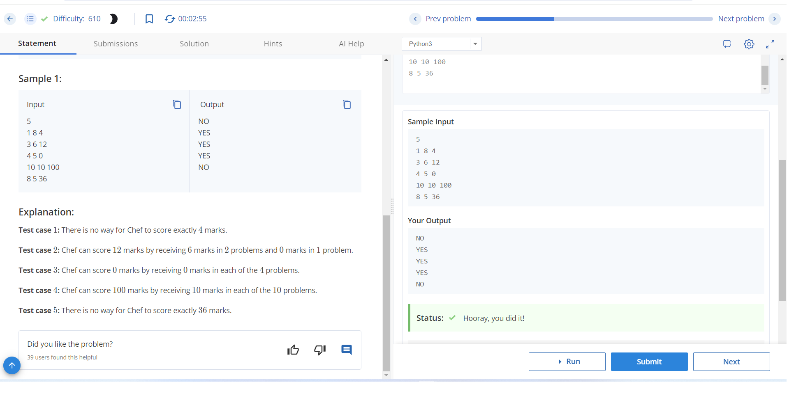
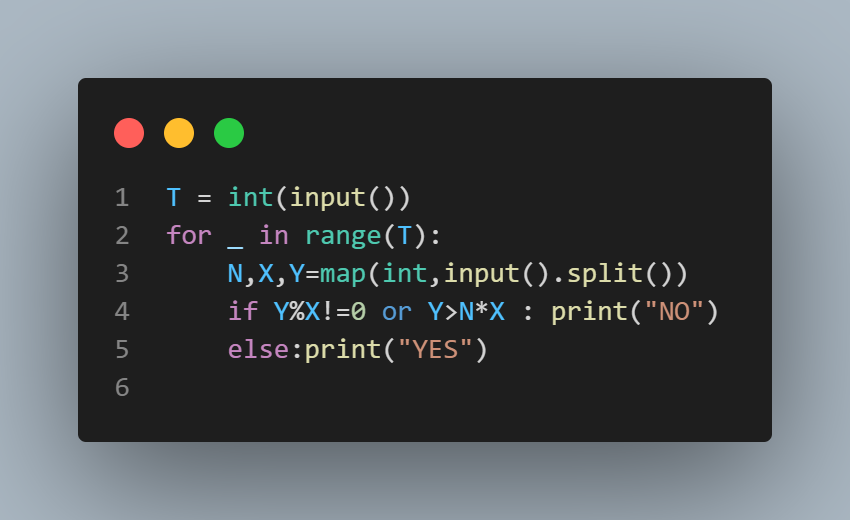

# Test Score Problem

## Problem Statement

In a test, there are N problems, each carrying X marks. In each problem, Chef either received X marks or 0 marks. Determine whether it is possible for Chef to achieve exactly Y marks.

### Input Format

The first line of input will contain a single integer T, denoting the number of test cases. Each test case consists of three integers N, X, Y, the number of problems, the maximum score for each problem, and the score Chef wants.

### Output Format

For each test case, output YES if Chef can achieve exactly Y marks, NO otherwise.

You can print each character of the string in uppercase or lowercase. For example, the strings Yes, YES, yes, and yEs, are all considered identical.

### Constraints

- 1 ≤ T ≤ 100
- 1 ≤ N ≤ 10
- 1 ≤ X ≤ 10
- 0 ≤ Y ≤ N * X

### Sample Input

```
5
1 8 4
3 6 12
4 5 0
10 10 100
8 5 36

```
## sample Output

```
NO 
YES
YES
YES
NO
```

### Explanation

- Test case 1: There is no way for Chef to score exactly 4 marks.
- Test case 2: Chef can score 12 marks by receiving 6 marks in 2 problems and 0 marks in 1 problem.
- Test case 3: Chef can score 0 marks by receiving 0 marks in each of the 4 problems.
- Test case 4: Chef can score 100 marks by receiving 10 marks in each of the 10 problems.
- Test case 5: There is no way for Chef to score exactly 36 marks.


