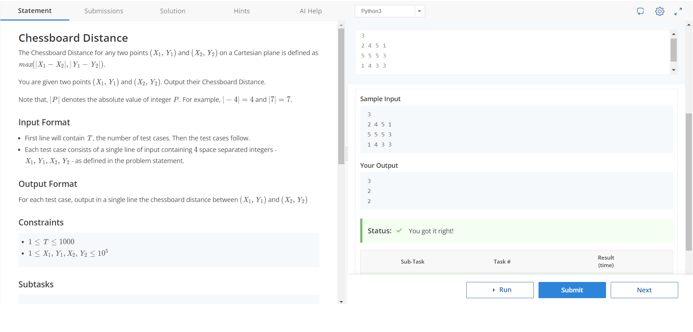

# Chessboard Distance

The Chessboard Distance for any two points (X1, Y1) and (X2, Y2) on a Cartesian plane is defined as max(|X1 - X2|, |Y1 - Y2|).

You are given two points (X1, Y1) and (X2, Y2). Output their Chessboard Distance.

## Input Format
- First line: Number of test cases, T
- Next T lines: Four space-separated integers X1, Y1, X2, Y2

## Output Format
For each test case, output in a single line the chessboard distance between (X1, Y1) and (X2, Y2)

## Constraints
- 1 ≤ T ≤ 1000
- 1 ≤ X1, Y1, X2, Y2 ≤ 10^5

## Sample Input
```
3
2 4 5 1
5 5 5 3
1 4 3 3 
```

## sample output
```
3
2
2
```


## Explanation
- Test case 1: The distance between (2, 4) and (5, 1) is max(|2 - 5|, |4 - 1|) = max(|-3|, |3|) = 3.
- Test case 2: The distance between (5, 5) and (5, 3) is max(|5 - 5|, |5 - 3|) = max(|0|, |2|) = 2.
- Test case 3: The distance between (1, 4) and (3, 3) is max(|1 - 3|, |4 - 3|) = max(|-2|, |1|) = 2.


