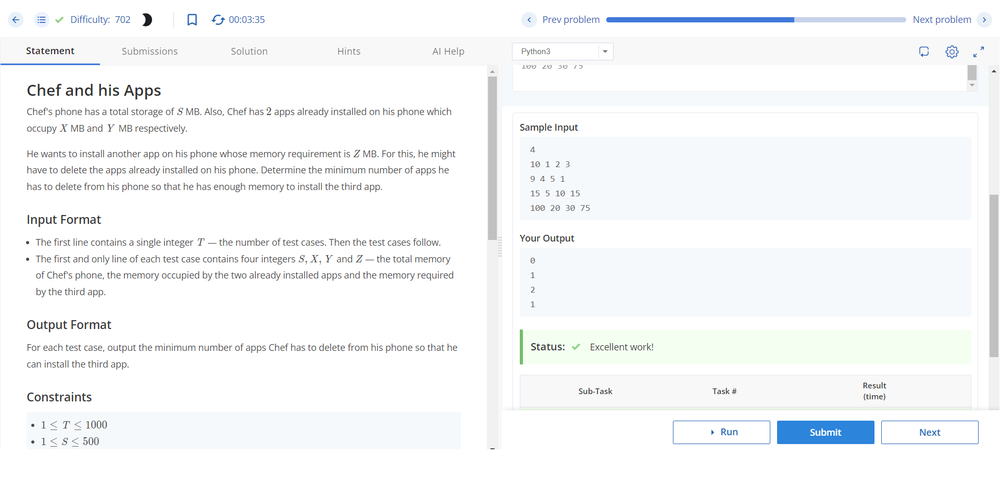
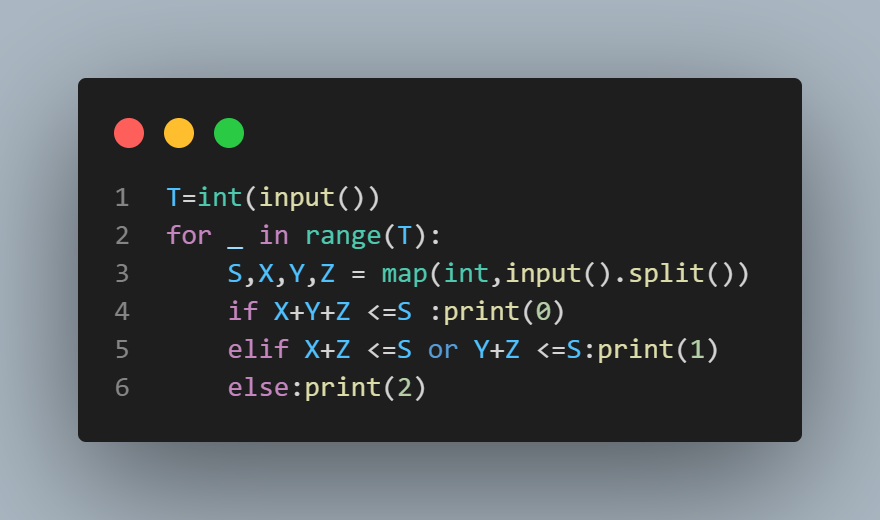

# Chef and his Apps

## Problem Statement
Chef's phone has a total storage of S MB. Additionally, Chef has 2 apps already installed on his phone which occupy X MB and Y MB respectively. He wants to install another app on his phone whose memory requirement is Z MB. For this, he might have to delete the apps already installed on his phone. Determine the minimum number of apps he has to delete from his phone so that he has enough memory to install the third app.

## Input Format
- The first line contains a single integer T — the number of test cases.
- For each test case:
  - The first and only line contains four integers S, X, Y, and Z — the total memory of Chef's phone, the memory occupied by the two already installed apps, and the memory required by the third app.

## Output Format
- For each test case, output the minimum number of apps Chef has to delete from his phone so that he can install the third app.

## Constraints
- 1 ≤ T ≤ 1000
- 1 ≤ S ≤ 500
- 1 ≤ X ≤ Y ≤ S
- X + Y ≤ S
- 1 ≤ Z ≤ S

## Sample Input
```
4
10 1 2 3
9 4 5 1
15 5 10 15
100 20 30 75
```

## sample output
```
0
1
2
1
```


## Explanation
- Test Case 1: The unused memory in the phone is 7 MB. Therefore Chef can install the 3 MB app without deleting any app.
- Test Case 2: There is no unused memory in the phone. Chef has to first delete one of the apps from the phone and then only he can install the 1 MB app.
- Test Case 3: There is no unused memory in the phone. Chef has to first delete both the apps from the phone and then only he can install the 15 MB app.
- Test Case 4: The unused memory in the phone is 50 MB. Chef has to first delete the 30 MB app from the phone and then only he can install the 75 MB app.


