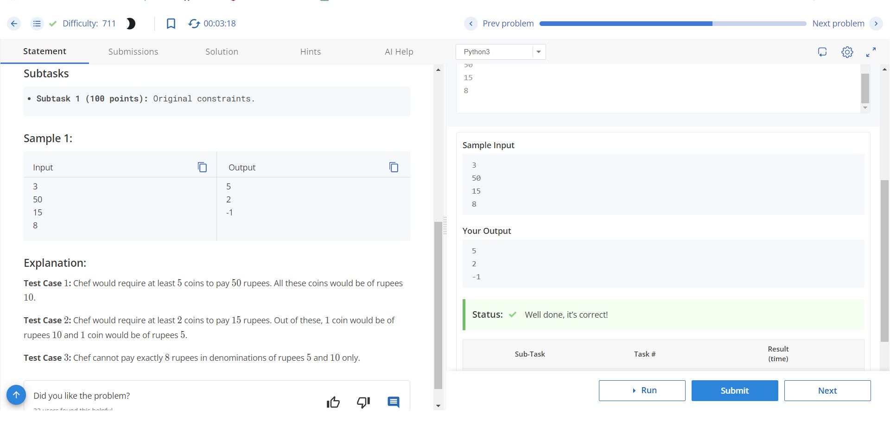
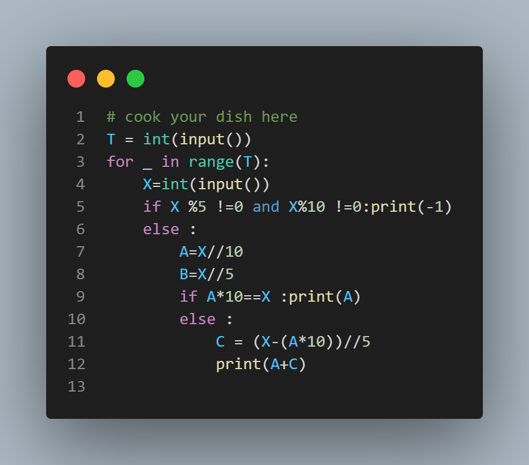

# Minimum Number of Coins

## Problem Statement
Chef has infinite coins in denominations of rupees 5 and rupees 10. Find the minimum number of coins Chef needs to pay exactly X rupees. If it is impossible to pay X rupees in denominations of rupees 5 and 10 only, print -1.

## Input Format
- The first line will contain T, the number of test cases.
- Then the test cases follow.
- Each test case contains a single integer X.

## Output Format
- For each test case, print a single integer: the minimum number of coins Chef needs to pay exactly X rupees. If it is impossible to pay X rupees in denominations of rupees 5 and 10 only, print -1.

## Constraints
- 1 ≤ T ≤ 1000
- 1 ≤ X ≤ 1000

## Subtasks
- Subtask 1 (100 points): Original constraints.

## Sample Input

```
3
50
15
8
```

## sample output
```
5
2
-1
```


## Explanation
- Test Case 1: Chef would require at least 5 coins to pay 50 rupees. All these coins would be of rupees 10.
- Test Case 2: Chef would require at least 2 coins to pay 15 rupees. Out of these, 1 coin would be of rupees 10 and 1 coin would be of rupees 5.
- Test Case 3: Chef cannot pay exactly 8 rupees in denominations of rupees 5 and 10 only.

