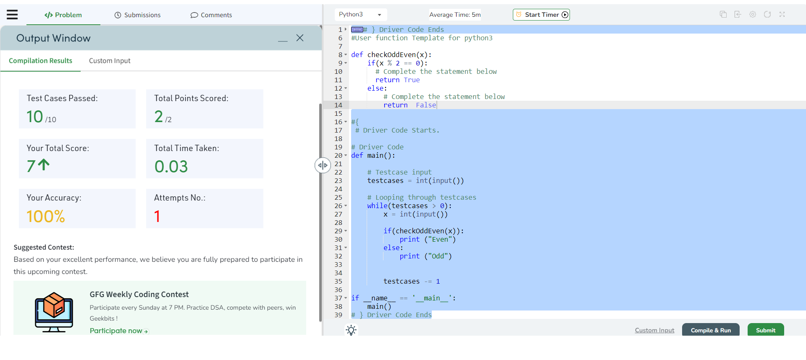

Given a positive integer x. Your task is to check, if it is even or odd (Any number that gives zero as remainder when divided by 2 is an even number)

### Example 1:
Input:
x = 4
Output:
Even
Example 2:

Input:
x = 5
Output:
Odd
Your Task:

Your task is to complete the function checkEvenOdd(), which returns True (In python, True starts with caps T) if the number is even, else return False (In Python, False starts with caps F).

Note: Python functions, just like variables, don't have a datatype keyword preceding the identifier.

Constraints:
1 <= x <= 106
