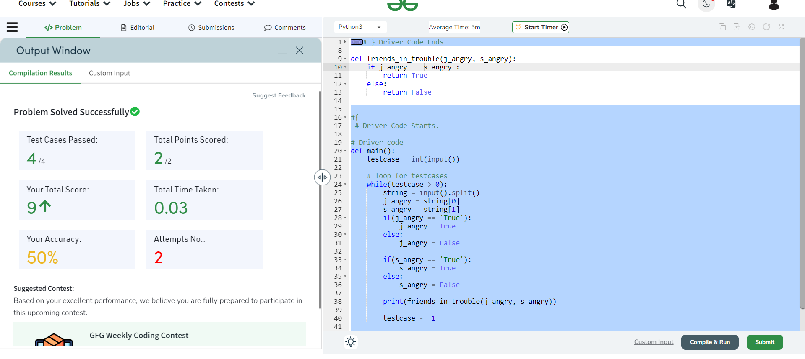

You are familiar with basics of input/output and many other useful things in Python. This module is all about conditional statements like if, elif, else; for, while, etc.

In Python, any conditional statement ends with ':' (proper indentation must be followed while working through loops).

There are two friends, John and Smith, and the parameters j_angry and s_angry to indicate if each is angry. You are in trouble if both of them are angry or no one of them is angry.

Now, complete the function which returns true if you are in trouble, else return false

Example 1:

Input:
j_angry = True, s_angry = True
Output:
True
Explanation:
Since both of them are angry,
so you are in trouble.
Example 2:

Input:
j_angry = True, s_angry = False
Output:
False
Explanation:
Only one of them is angry, 
so we are not in trouble.
Your Task:
This is a function problem, you don't need to take any input. Complete the function friends_in_trouble() and return True or False.

