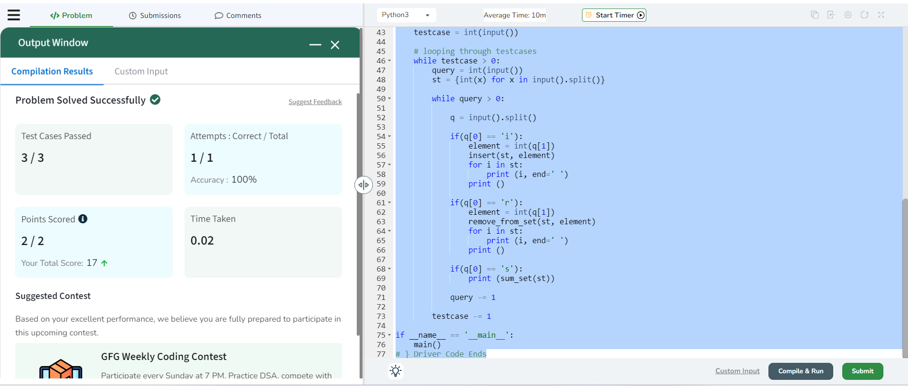

A set is an unordered collection of items where every element is unique and must be immutable, but the set is mutable. You cannot access an element of the set using indexing or slicing, but you can update the set.

Some important functions in Set in Python:
add(): Adds an element to the set.
clear(): Removes all elements from the set
discard(): Removes an element from the set if present.
remove(): Removes an element from the set. If the element is not present, it raises an error.
pop(): Removes and returns an arbitrary set element. Raise the error if the set is empty.
union(): Returns the union of sets in a new set
update(): Updates the set with the union of itself and others
len(): Return the length of the set.
sorted(): Return a new sorted list from elements in the set.
sum(): Return the sum of all elements in the set.

Let's implement these methods through a question. Given Q queries to do some operation on Set, the task is to perform all the queries in the Set as given below:
a. i element: Adds an element to the set.
b. r element: Remove an element from the set.
c. s: Find the sum of elements in the set. Returns the sum of elements in the set.
